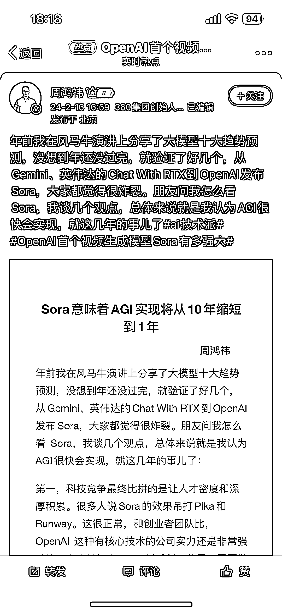
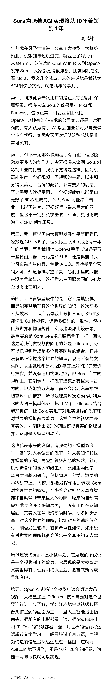

# 360 周鸿祎对 OpenAi 发布的 Sora 进行分析

> 原文：[`www.yuque.com/for_lazy/xkrm14/gas1wfs4agmsg14a`](https://www.yuque.com/for_lazy/xkrm14/gas1wfs4agmsg14a)

作者： 坤坤

日期：2024-02-16

点赞数：**59**

* * *

正文：

360 周鸿祎 关于 OpenAi 发布的 Sora 的分析。

* * *

评论区：

亦仁 : 中标，术值+2。 在上方专栏点击 #中标，可查看所有中标风向标

* * *

公众号懒人搜索，懒人专属群分享