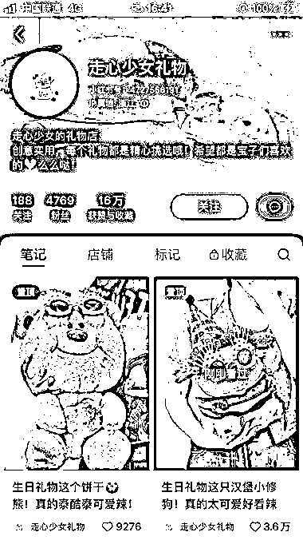
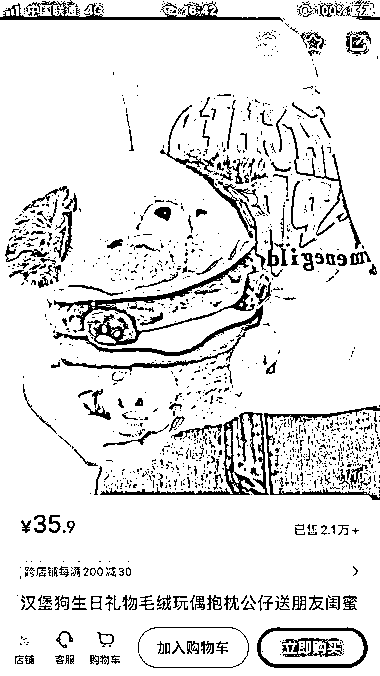
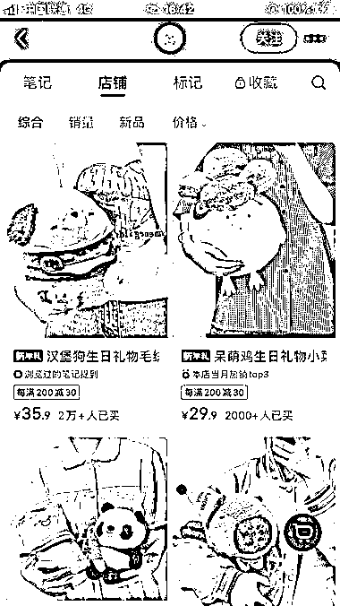
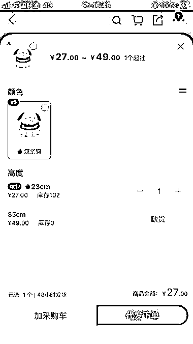

# 小红书店铺卖汉堡狗毛绒公仔，单品利润超过 16 万元

> 原文：[`www.yuque.com/for_lazy/xkrm14/lcrcggh6l61hedmz`](https://www.yuque.com/for_lazy/xkrm14/lcrcggh6l61hedmz)

作者： 李幸运

日期：2024-02-04

点赞数：**71**

* * *

正文：

小红书店铺，卖毛绒公仔。 一个汉堡狗多个 sku，最便宜的 sku 售价 35.9 元，卖了 2w+，1688 上售价 27 元，单品利润 16w+，店铺其他产品也有销量。
笔记都是图文，对镜实拍，不需要露脸。

* * *

评论区：

Mr.Mcphist : 近期流量好像不行了，感觉思路可以变种

朝暮拾花 : 这个量好像没有加运费吧

我就叫 _ 马小玉💦 : 照片是自己实物拍摄的吗

* * *

公众号懒人搜索，懒人专属群分享