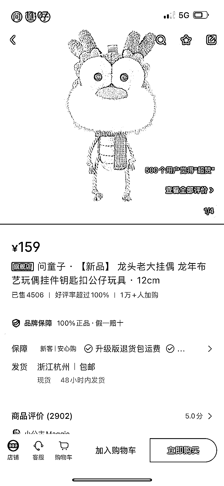
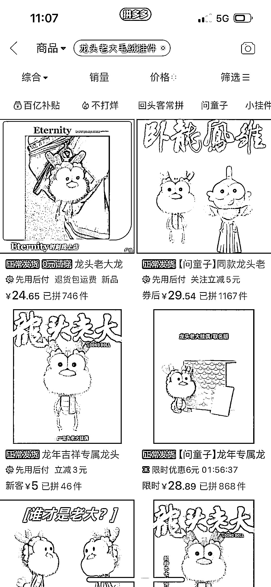
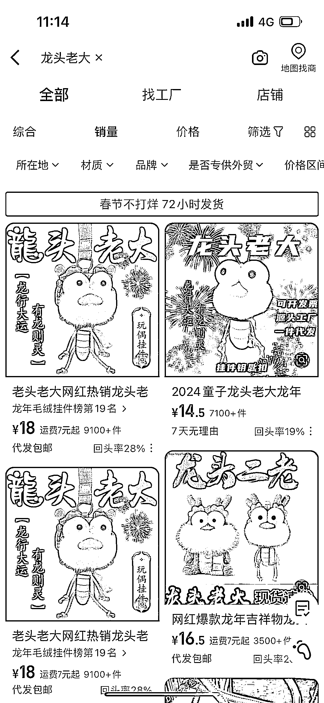

# 小红书龙年挂偶单价 159，销量 4500+，3 个月 GMV 达 71 万+，利润空间大

> 原文：[`www.yuque.com/for_lazy/xkrm14/xgw1x9hnpgdgutie`](https://www.yuque.com/for_lazy/xkrm14/xgw1x9hnpgdgutie)

作者： 真实姓名

日期：2024-02-05

点赞数：**62**

* * *

正文：

小红书 龙年挂偶 单价 159 销量 4500+，最早评价 23 年 11 月，3 个月 gmv 71 万+
拼多多、阿里巴巴单价在 18-30 不等，生产成本应该较低，利润空间大。

* * *

评论区：

Dreamland : 有点离谱了，哈哈哈哈，不知道能不能加私域卖

真实姓名 : 可以试试😂

Dreamland : 哈哈哈哈，的确

Angie•三三 : 这个之前我发过，前段时间问童子已经出了打击盗版的说明，我自己在 pxx 买了好几个，个个不一样哈哈哈

真实姓名 : 嗯，可以加上数据容易中标。主要这产品真赚钱[偷笑]

Angie•三三 : 官方店才可以卖这么贵，小众 IP[偷笑]

* * *

公众号懒人搜索，懒人专属群分享