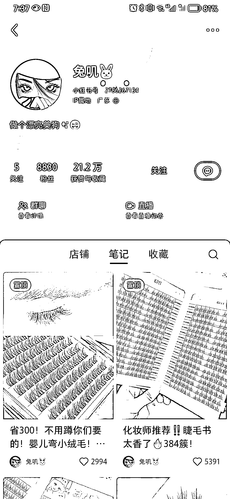
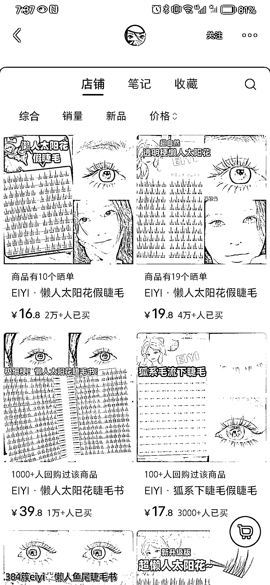
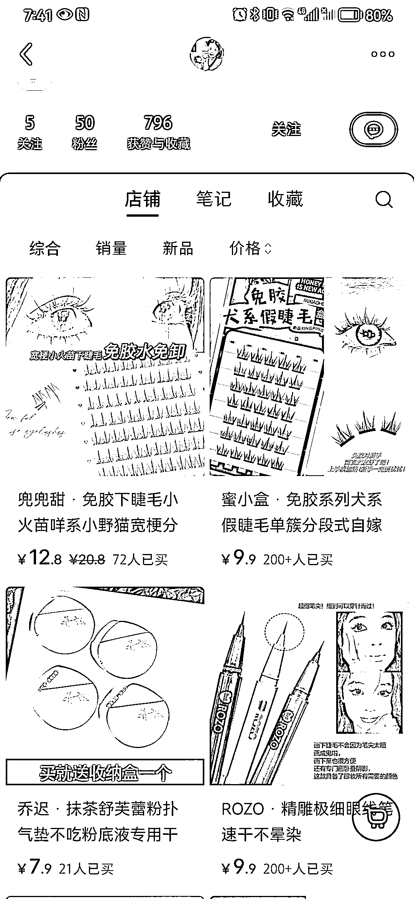

# 新年新气象，赚钱新风向：过年中标挑战赛

> 原文：[`www.yuque.com/for_lazy/xkrm14/xdvrgql7p23zaq0u`](https://www.yuque.com/for_lazy/xkrm14/xdvrgql7p23zaq0u)

作者： 小鱼小虾

日期：2024-02-12

点赞数：**32**

* * *

正文：

小红书卖免胶假睫毛的，有一个账号里有几个商品销量都几万+（图一，图二），解决传统假睫毛需要沾胶水，沾胶水困难的痛点。然后又顺着销量看，有一个 50 粉的账号，卖出了 200+的销量。说明免胶假睫毛在小红书卖得不错，有市场。

* * *

评论区：

余哎呀 : 为什么五十粉丝也能卖货呢

清风明月 : 几万利润[奸笑]销量怎么再做大点

亦仁 : 中标，术值+2。 在上方专栏点击 #中标，可查看所有中标风向标

* * *

公众号懒人搜索，懒人专属群分享