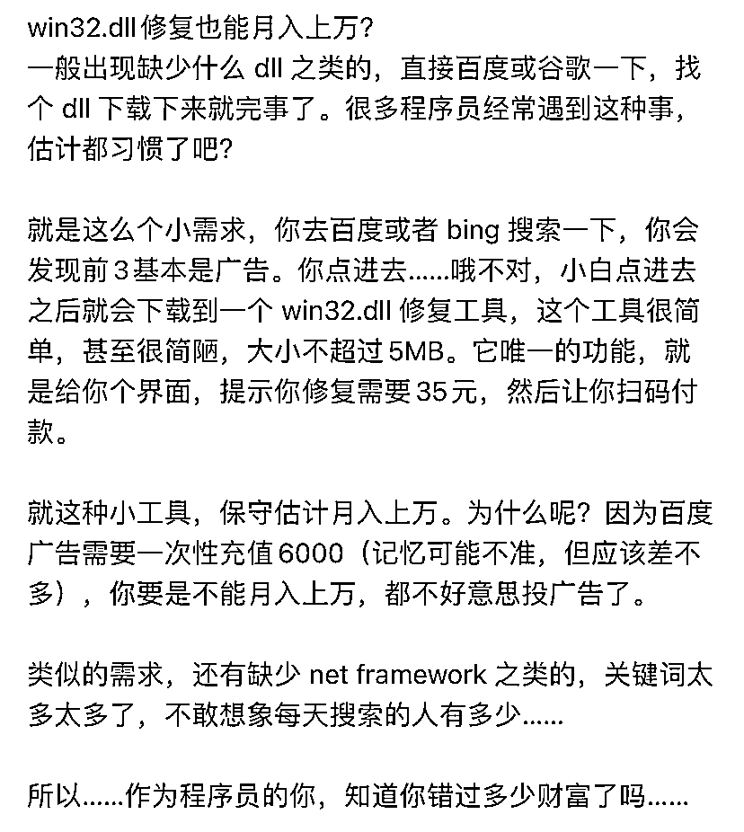
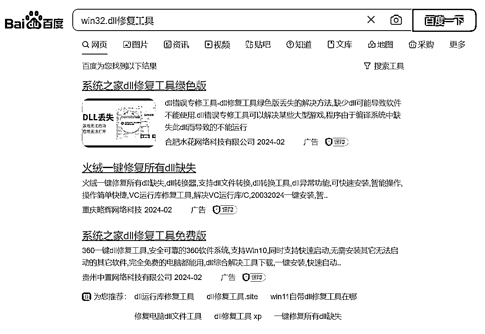

# 月入过万的 win32.dll 修复工具，简单实用又赚钱

> 原文：[`www.yuque.com/for_lazy/xkrm14/ygbo7wsrerl48ut9`](https://www.yuque.com/for_lazy/xkrm14/ygbo7wsrerl48ut9)

作者： 罗破帽

日期：2024-02-10

点赞数：**48**

* * *

正文：

【win32.dll 修复工具也能月入过万】 a.百度或者 bing
搜索一下，你会发现前 3 基本是广告。小白点进去之后就会下载到一个 win32.dll 修复工具，这个工具很简单，甚至很简陋，大小不超过 5MB。
b.它唯一的功能，就是给你个界面，提示你修复需要 35 元，然后让你扫码付款。就这种小工具，保守估计月入上万。类似的需求，还有缺少 netframework
之类的，关键词太多太多了，不敢想象每天搜索的人有多少。

* * *

评论区：

王大诗 : 商机关键词：修复工具[呲牙]

亦仁 : 中标，术值+2。 在上方专栏点击 #中标，可查看所有中标风向标

* * *

公众号懒人搜索，懒人专属群分享