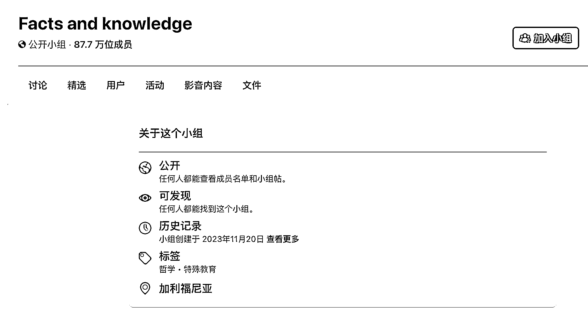
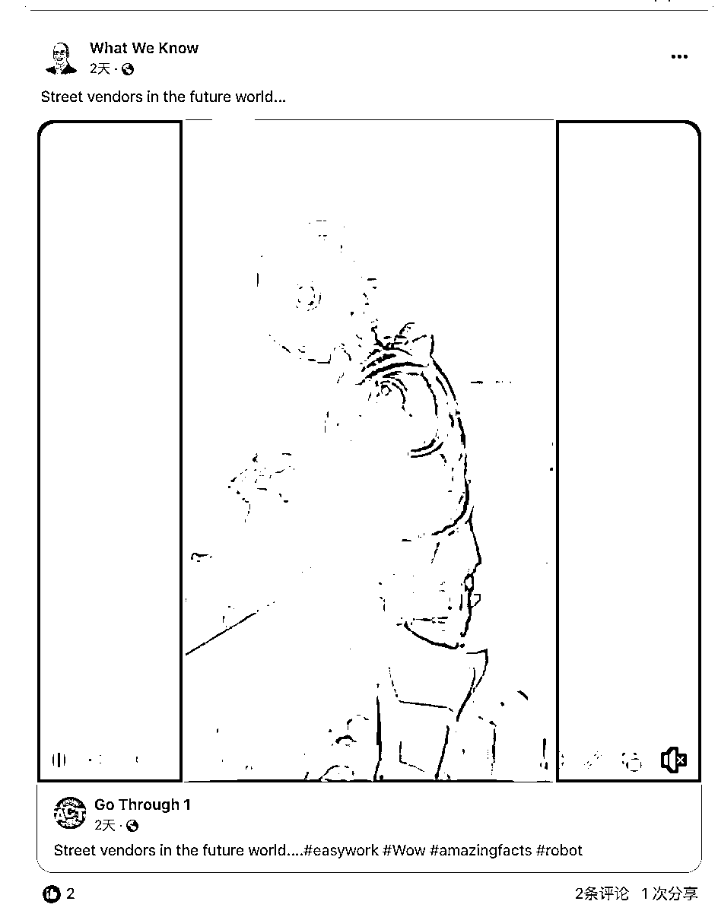
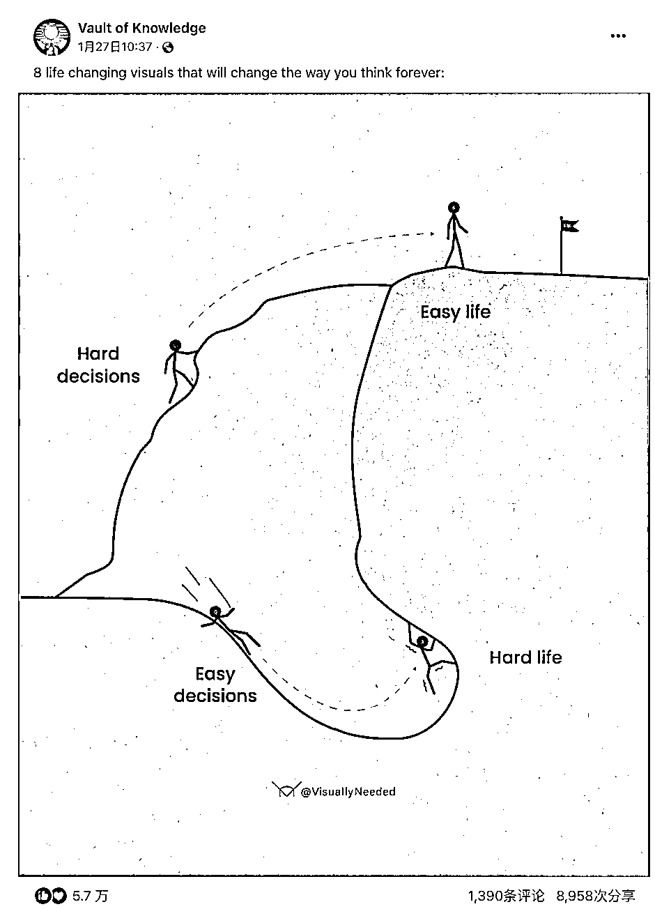

# Facts and knowledge：一个拥有 87 万+成员的英语社群，探索世界冷知识的商机

> 原文：[`www.yuque.com/for_lazy/xkrm14/lm2ytc27wmkkdqs3`](https://www.yuque.com/for_lazy/xkrm14/lm2ytc27wmkkdqs3)

作者： 林林 AIGC 写作

日期：2024-02-05

点赞数：**87**

* * *

正文：

一个名叫“Facts and knowledge”的脸书社群，去年 11 月才创建，到现在已经有 87 万+的成员了。
这个群主大多数用户来自英语国家，他们分享的都是世界上一些有趣的事实、冷知识。在我看来，这类人其实对世间万物充满了好奇心，如果能够利用他们的这类心理销售配套的有创意的商品，相信也会是一门不错的生意。

* * *

评论区：

仰仰 : 感觉国外猎奇心理挺重的，不管是在油管、推特、抖音、Facebook 等平台有很大的自然流量。[奸笑]

林林 AIGC 写作 : 感谢分享

时光荏苒 : 艰难的决定，轻松的生活，简单的决定，艰难的生活。

倪大胖 : 赞同

* * *

公众号懒人搜索，懒人专属群分享