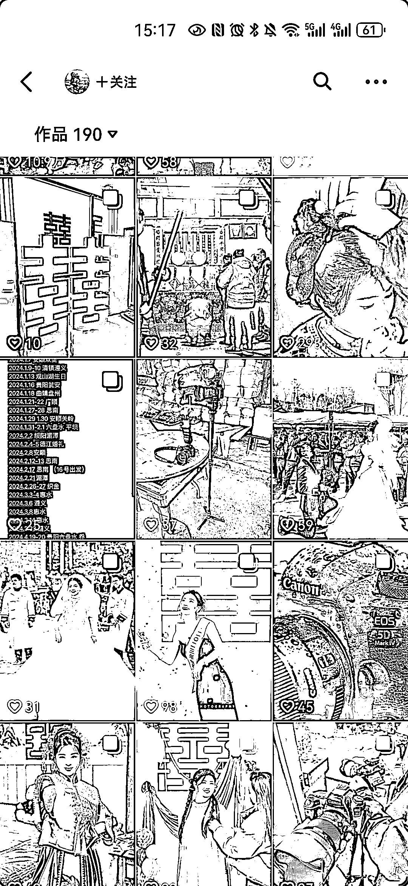
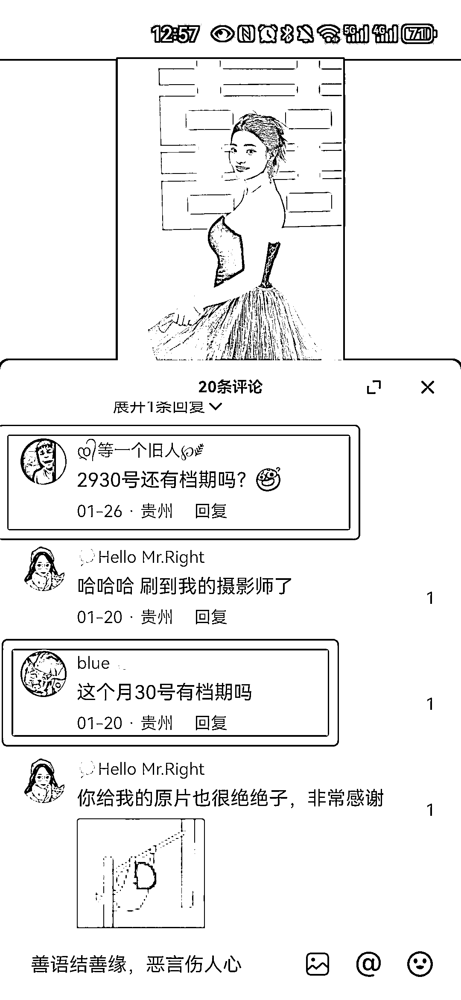

# 低粉丝量但高收入的婚礼摄影师

> 原文：[`www.yuque.com/for_lazy/xkrm14/mz3htb2bf6l7yad5`](https://www.yuque.com/for_lazy/xkrm14/mz3htb2bf6l7yad5)

作者： 希平

日期：2024-02-05

点赞数：**57**

* * *

正文：

做婚礼摄影师
这个账号“你的摄影师龙宇航”，粉丝只有 8000 左右（图 1），作品内容基本是顾客授权的结婚照片，点赞数 50 左右（图 2），但作品的评论区好多人问档期（图 3 图 4）
销售数据：从他晒出来的已定档期，每个月都有 10 单，从我那里了解到一单要 1w-3w，也就是一个月收入 10w-30w（图 5）

* * *

评论区：

李词宝 : 我似乎听说很多地方的跟拍市场价没有那么高，小地方的可能 800-1000 左右，大点的地方也好像没那么多。剪辑也很费时间，需要请人。

李词宝 : 一个月拍 10 场，强度已经非常高了，拍一天，剪辑非常非常费时间

希平 : 这个太便宜了，要是自己做流量的，一天就要收大几千。我认识的一个深大师弟，一天就收 1w，好多人等着他去拍，因为他拍的真的很好

希平 : 可以背后有工作室的，有人负责剪辑，有人负责拍摄

李词宝 : 是的，能拍出那个水平的，本身就是靠本事吃饭。没有个多少年功底，不是随随便便都能做到的。 做流量只是加持，保障了订单的稳定。

愿景 : 这个要求不一样，有双机位，无人机，全家福这些，800-1000 这个价格拍的很难看，就是走一个过场

爱吃米粉的木棉 : 除了婚礼摄影师还有化妆师、主持人、音响师等，如果是婚礼主持人，可以和主家（客户），说单独主持人多少钱，然后还提供一种婚礼督导的项目（然后再从当地的学校找学生兼职，我们学校那边是有学长做主持然后带着学弟学妹做婚礼督导，等慢慢有经验了就可以转成婚礼主持）同时当地和邻近地方的婚礼主持之间也可以进行抱团（因为有时候档期可能撞车），以及酒店方面和婚纱店到时候手里客户多了也可以进行合作。当时我也跟过两场，的确费精力，但是主家一般都舍得花钱（当然不排除有那种不太友好地）

* * *

公众号懒人搜索，懒人专属群分享