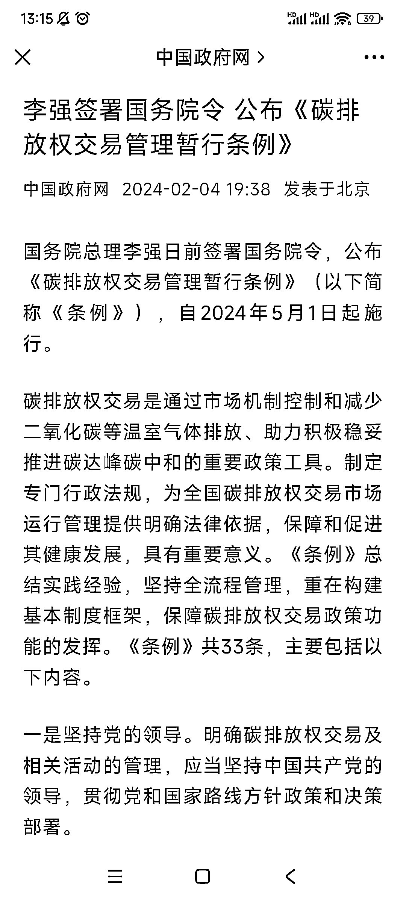

# 碳排放交易新政策实施，市场机会悄然兴起

> 原文：[`www.yuque.com/for_lazy/xkrm14/qn0v1d9t7n443wkf`](https://www.yuque.com/for_lazy/xkrm14/qn0v1d9t7n443wkf)

作者： 阿黎

日期：2024-02-05

点赞数：**42**

* * *

正文：

赛道:碳排放交易 新政策:《碳排放权交易管理暂行条例》将自 5 月 1 日起施行
影响:碳排放交易市场刚刚开始，意味着有很多官方或者交易主体有很多需求，需要通过第三方比如技术公司等进行解决，这就有很多需求和机会，谁先进场，谁先吃到红利，有 to
B 业务或者碳交易业务的可以积极寻求机会。 随手摘两条条例原文，都是机会:
【重点排放单位可以委托依法设立的技术服务机构开展温室气体排放相关检验检测、编制年度排放报告。】
【碳排放权交易可以采取协议转让、单向竞价或者符合国家有关规定的其他现货交易方式。】 —— 拓展阅读: 生财有篇精华帖，《双碳环境下的商机分析》
链接:[李强签署国务院令 公布《碳排放权交易管理暂行条例》](https://mp.weixin.qq.com/s/8pjjlgX25VcIlPEoBDx0kg) [「双碳」大环境下的商机分析](https://t.zsxq.com/17bNEQnnd) 

* * *

评论区：

* * *

公众号懒人搜索，懒人专属群分享