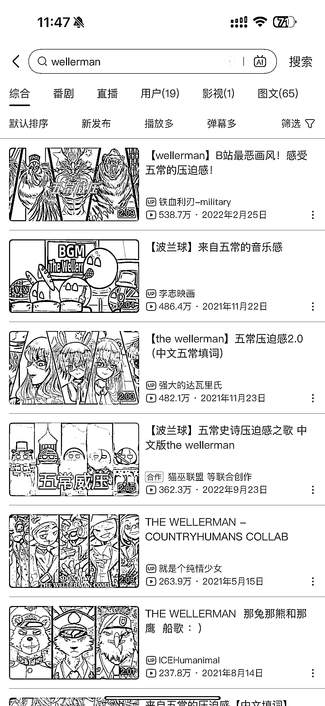

# 小学生对互联网术语了如指掌，动画混剪歌曲流量百万以上

> 原文：[`www.yuque.com/for_lazy/xkrm14/lp8e0rqlrmteg0wb`](https://www.yuque.com/for_lazy/xkrm14/lp8e0rqlrmteg0wb)

作者： Denggh

日期：2024-02-08

点赞数：**24**

* * *

正文：

小孩群体流量很大，今天和家里几个小学生小孩哥小孩姐玩，发现他们了解的东西范围超出我的认知。
对 B 站，大会员，弹幕，短视频等互联网术语非常了解。他们能熟练使用 B 站看视频学英文歌。
他们看的这些耳熟能详的歌曲，全是动画混剪，流量随随便便就是百万以上播放量。有感兴趣的朋友可以看看这块流量。

* * *

评论区：

* * *

公众号懒人搜索，懒人专属群分享