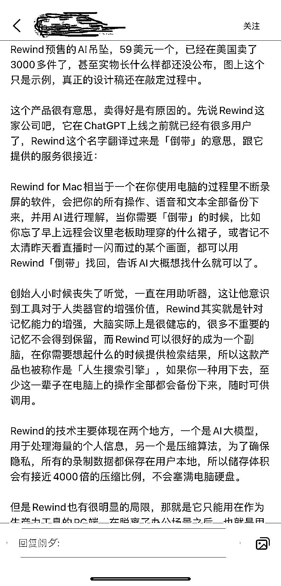
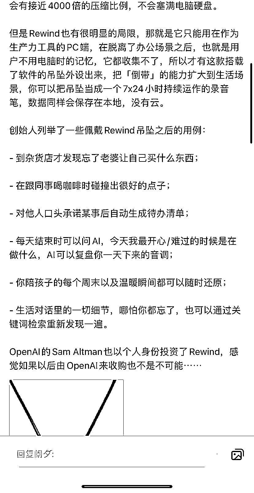
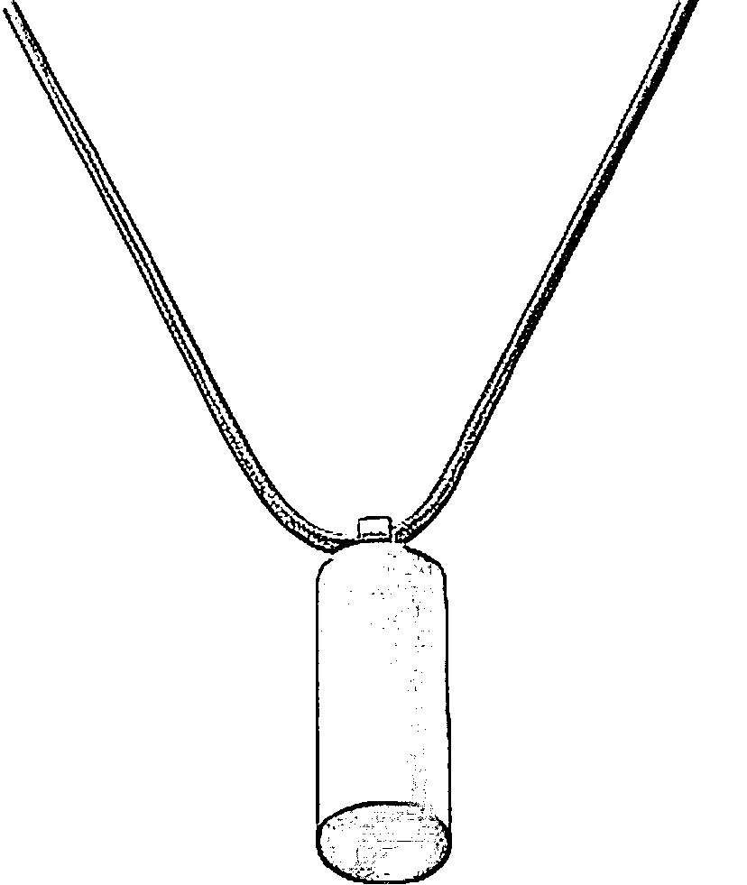

# Rewind 预售的 Al 吊坠销售火爆，设计未公布已卖出 3000 多件

> 原文：[`www.yuque.com/for_lazy/xkrm14/pibdt3dud5bv3h0f`](https://www.yuque.com/for_lazy/xkrm14/pibdt3dud5bv3h0f)

作者： 罗破帽

日期：2024-02-06

点赞数：**87**

* * *

正文：

a.Rewind 预售的 Al 吊坠，59 美元一个，已经在美国卖了 3000
多件了，甚至实物长什么样都还没公布，图上这个只是示例，真正的设计稿还在敲定过程中。（销售额：124 万元）
b.有这款搭载了软件的吊坠外设出来，把「倒带」的能力扩大到生活场景，你可以把吊坠当成一个 7x24 小时持续运作的录音笔，数据同样会保存在本地，没有云。
c.创始人列举了一些佩戴 Rewind 吊坠之后的用例： ①到杂货店才发现忘了 老婆让自己买什么东西；②在跟同事喝咖啡时碰撞出很好的点子；
③对他人口头承诺某事后自动生成待办清单； ④每天结束时可以问 Al，今天我最开心/难过的时候是在做什么，Al 可以复盘你一天下来的音调;
⑤你陪孩子的每个周末以及温暖瞬间都可以随时还原； ⑥生活对话里的一切细节，哪怕你都忘了，也可以通过关键词检索重新发现一遍。
d.不仅在美国需求大，在国内的社交软件评论区都是想买。

* * *

评论区：

Sofie : 这种在哪里看众筹啊

清风明月 : 我都想买了[捂脸]

山东临沂健身训练营 : 哪里买

温暖 : 我也想买，哪里有

* * *

公众号懒人搜索，懒人专属群分享