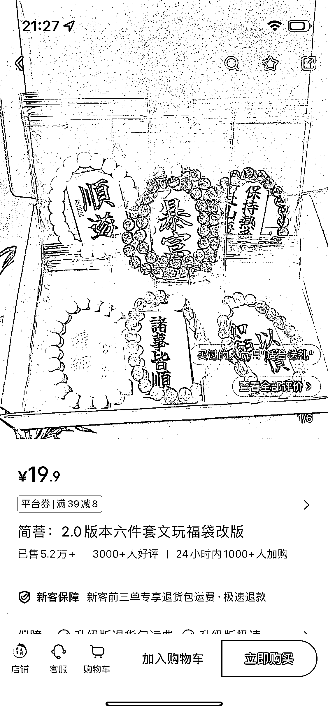

# 小红书店铺卖文玩，销售火爆，销售额预估 200 万+

> 原文：[`www.yuque.com/for_lazy/xkrm14/toh5alr7ckziectp`](https://www.yuque.com/for_lazy/xkrm14/toh5alr7ckziectp)

作者： 李幸运

日期：2024-02-21

点赞数：**51**

* * *

正文：

小红书店铺，卖文玩 价格 19.9，一个链接卖了 5.2 万+，销售额 100 万+，店铺其他链接也有销量，总销量 10.2 万，销售额预估 200 万+
都是实拍视频，笔记视频模式都是差不多的，比较简单。 不过，这个适合有这方面货源的，一件代发不适合，1688 和拼多多价格都没有优势。

* * *

评论区：

* * *

公众号懒人搜索，懒人专属群分享