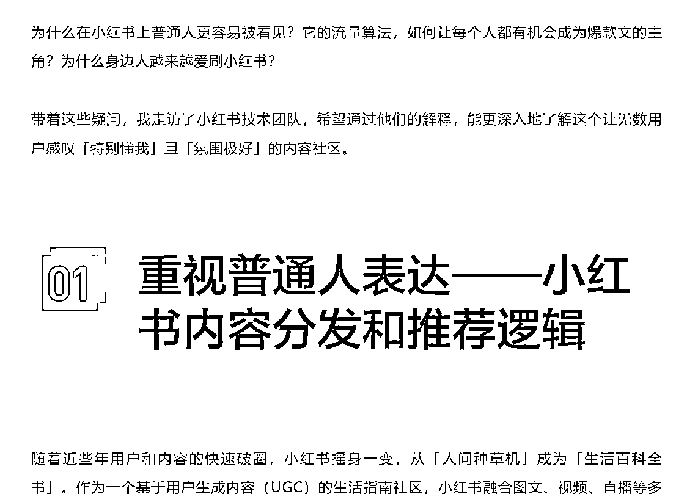
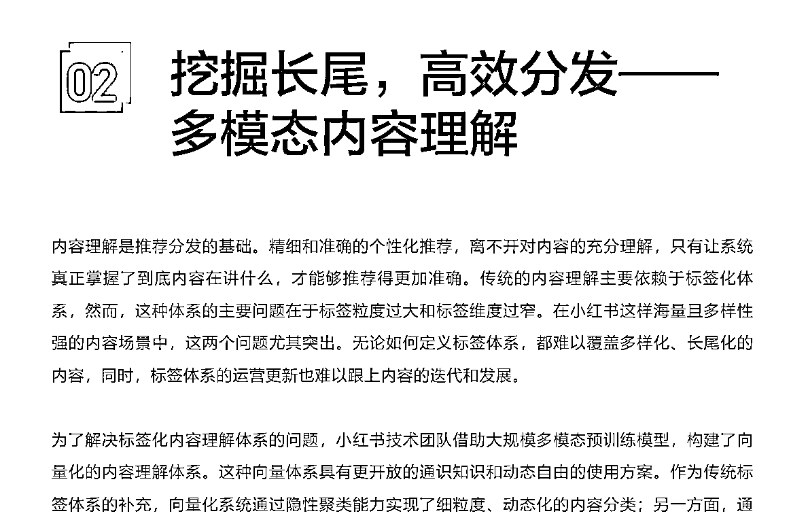
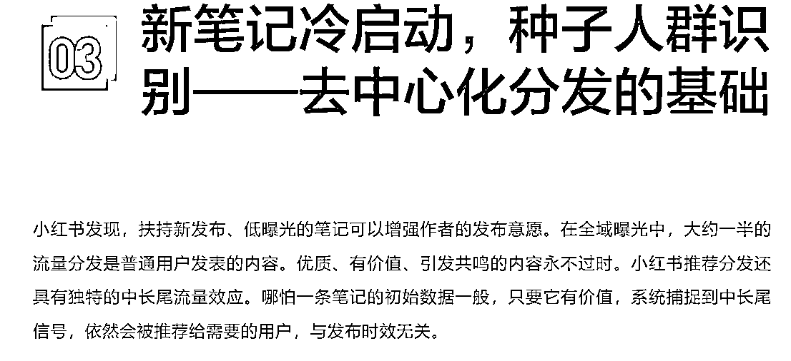
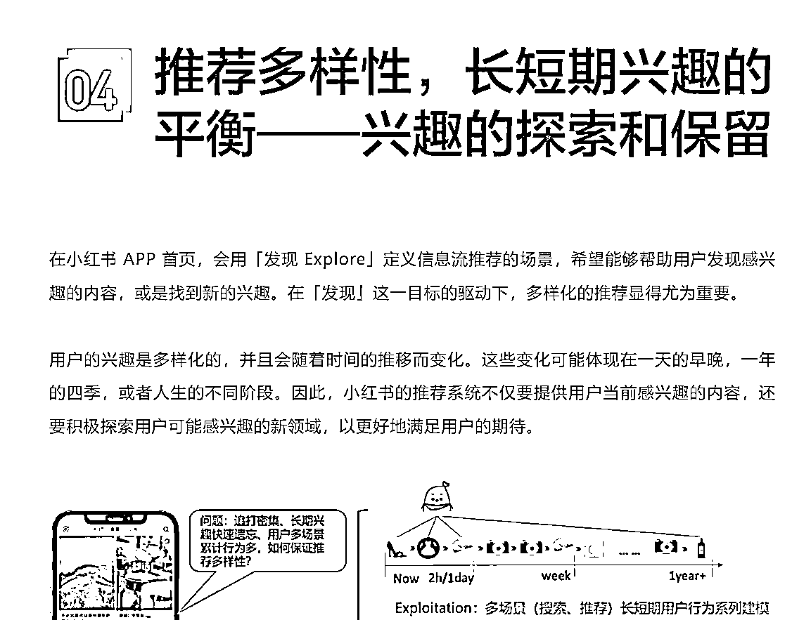

# 解密小红书流量算法：揭秘爆款背后的机制

> 原文：[`www.yuque.com/for_lazy/xkrm14/zyi77hz4qaq8ictg`](https://www.yuque.com/for_lazy/xkrm14/zyi77hz4qaq8ictg)

作者： 橘子小姐

日期：2024-02-22

点赞数：**71**

* * *

正文：

爆款背后的机制：解码小红书流量算法 小红书官方技术团队解释，纳入考虑的因子包括点击、时长、完播、下滑、质量、点赞、收藏、关注、转发、评论等。
小红书的推荐系统会根据用户的习惯调整各因子的权重，一般会综合考虑消费、互动和体验类指标，结合用户的消费行为偏好，实现个性化的权重组合。
同时，小红书推荐系统也会根据笔记的发布意图来调整收藏、转发和评论的权重，例如，日常分享类的笔记更看重点赞，工具类笔记更看重收藏，求助类笔记更看重评论。
来源：[爆款背后的机制：解码小红书流量算法](https://mp.weixin.qq.com/s/cAxohCGF2mpYBn5rU3S1Ew)

* * *

评论区：

认知小窗-认哥 : 对新人友好的平台，心智有了

* * *

公众号懒人搜索，懒人专属群分享