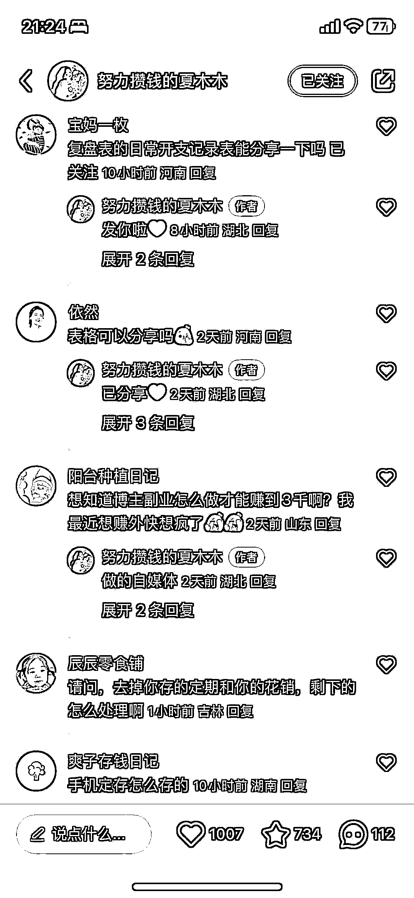

# 接地气的小红书博主教你如何存钱

> 原文：[`www.yuque.com/for_lazy/xkrm14/fnr9gsu5eguhh66o`](https://www.yuque.com/for_lazy/xkrm14/fnr9gsu5eguhh66o)

作者： 绿蚁

日期：2024-02-22

点赞数：**50**

* * *

正文：

平台：小红书
教人存钱的一个博主，方法没有什么特别的新意，但是博主说自己月入才 3000，非常接地气，比起小红书那些动不动就存款几十几百万的博主，这个更接近我们普通人，显得更真实。博主自己整理了一个当月开支复盘表，很受欢迎，许多人要！这个可以引流私域，5W 粉丝，接了不少广告，主题跟自己账号也不违和！

* * *

评论区：

* * *

公众号懒人搜索，懒人专属群分享