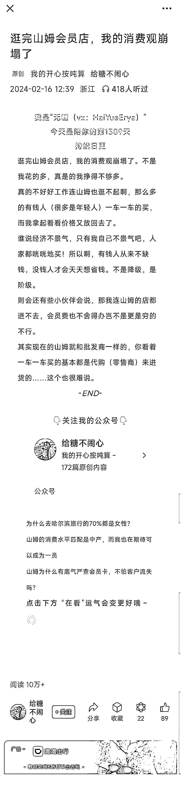
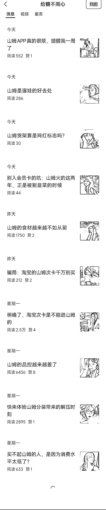

# 公众号新玩法：垂直写作吸引高阅读量

> 原文：[`www.yuque.com/for_lazy/xkrm14/he9tnelqwmbpw4l7`](https://www.yuque.com/for_lazy/xkrm14/he9tnelqwmbpw4l7)

作者： 阿黎

日期：2024-02-21

点赞数：**56**

* * *

正文：

已有项目新玩法，公众号针对某个对象，特别垂直地来写文章，也有高阅读。 图 1 这篇，初看平平无奇，短短的文章有 10 万+。
图 2，文章下方的推荐文章，也有过万浏览量 图 3，公号文章，全部是说山姆的 同理可得，换成其他有争议、有热点属性的词，也是成立的。

* * *

评论区：

阿甜 AI 数字人（克隆* : 看到之前一个中标内容 是山姆会员卡项目 搞到私域拉新也可 这种垂直的很像做自媒体电商的单品

* * *

公众号懒人搜索，懒人专属群分享