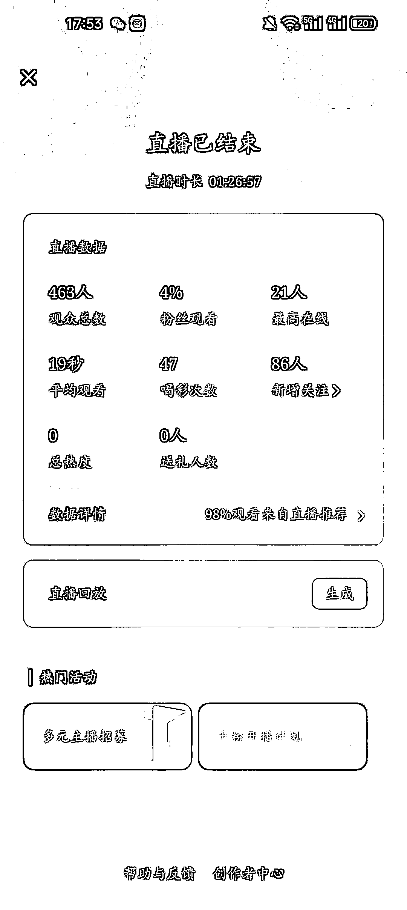
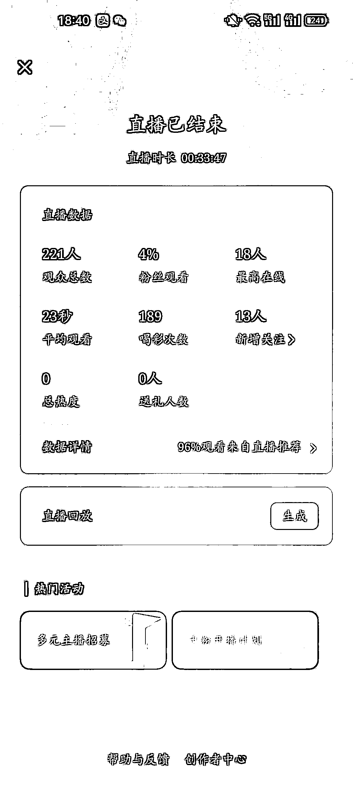
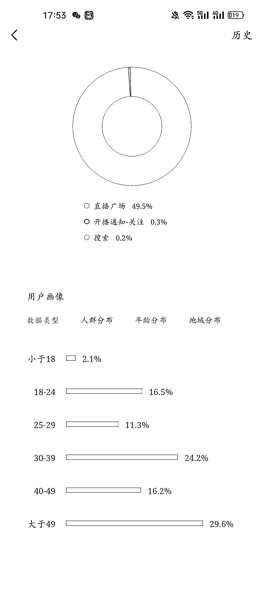
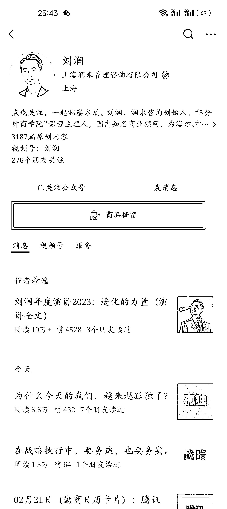

# 视频号流量扶持，涨粉利器，语音开播、放歌、挂福袋，轻松实现粉丝增长

> 原文：[`www.yuque.com/for_lazy/xkrm14/ozy6huekd85m6sg7`](https://www.yuque.com/for_lazy/xkrm14/ozy6huekd85m6sg7)

作者： 韩北樱

日期：2024-02-21

点赞数：**51**

* * *

正文：

最近视频号的流量扶持比较大，需要做涨粉的圈友可以试试。 语音开播，放歌，挂福袋，放着就可以。 推荐来的流量不太精准，但有两个作用：
1.500 粉才可以在电脑上直播 2.千粉开通橱窗，可以放在公众号的关注页面。

* * *

评论区：

吴海迪 : 对对对 昨晚睡不着 播了几场涨了 100 粉

韩北樱 : 厉害的！！！

韩北樱 : 谢谢亦仁大大[爱心]！

吴海迪 : 哈哈哈主要是喝了奶茶导致睡不着

刘卡卡 : 不会操作的，可以看下这个教程，最近和 60 多个朋友一起做，都涨了几百上千粉
[`k8g3o29k9j.feishu.cn/wiki/GlYywNQjki4JP8kT...`](https://k8g3o29k9j.feishu.cn/wiki/GlYywNQjki4JP8kTPnecsDDsnjc?from=from_copylink) 

阿甜 AI 数字人（克隆* : 最近测试了两场，10mins 左右提示违规，停止开播一天，橱窗下架一天

* * *

公众号懒人搜索，懒人专属群分享