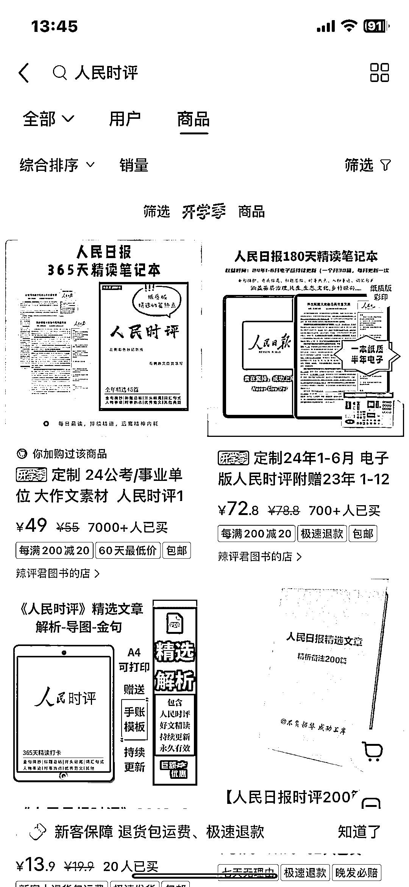
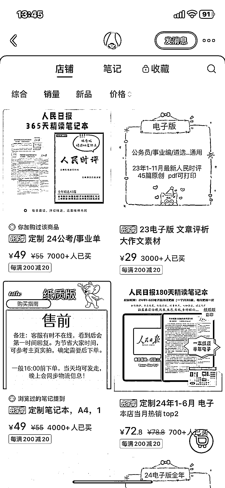
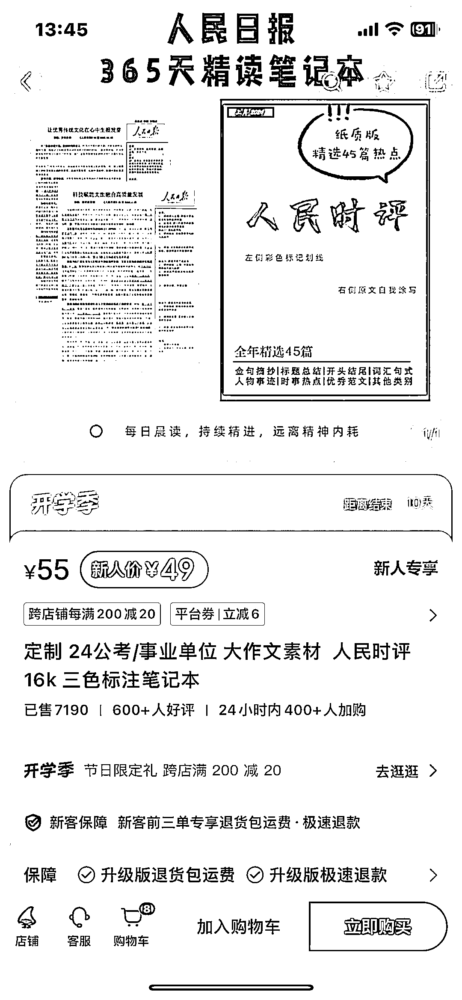
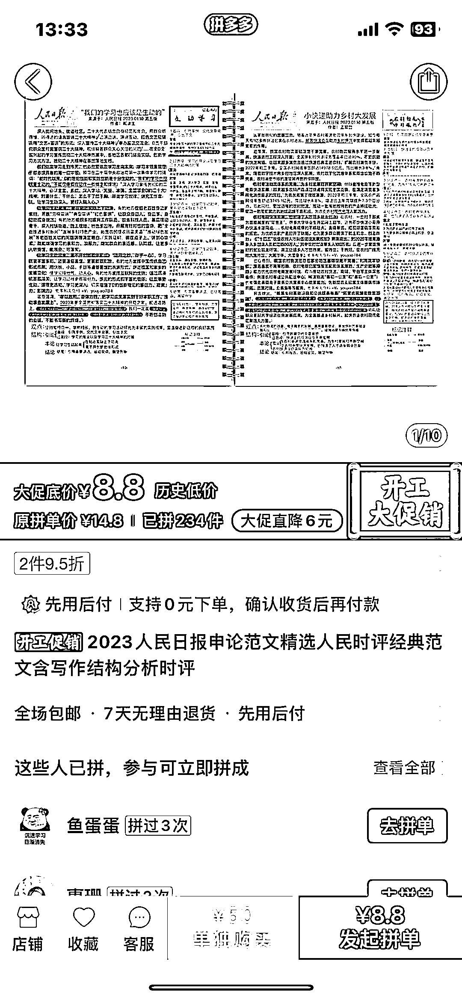

# 卖考公的申论资料，高利润的赚钱机会

> 原文：[`www.yuque.com/for_lazy/xkrm14/iveadq8abr57aznu`](https://www.yuque.com/for_lazy/xkrm14/iveadq8abr57aznu)

作者： 李半文

日期：2024-02-20

点赞数：**82**

* * *

正文：

卖考公的申论资料——人民日报范文和人民时评。纸质版和电子版都可以卖。 这些资料都是公开的，但是需要整理和归纳，原本的资料是一年 365 篇，比如 23
年的。 该博主应该是自己经过电子版的整理之后了（精选 45 篇），再在某宝上找人打印售卖的。电子版的售价 27 元，纸质版的 49
元，利润非常高，赶上三月多省市联考，目前销量非常不错。
而且该博主是几个账号，矩阵操作，GMV：9800*49+29*2000+78*800+49*1000,这还只是一个账号的。
另外还博主还卖定制笔记本、作文素材等。

* * *

评论区：

华龙 : 有版权问题吗

李半文 : 这个都是人民日报公开的，应该没有，就和做 TED 资料的一样

晴天哥哥 : 都是公开的内容，没什么版权不版权。咱只是做内容的整理而已。

田晶晶 : 我觉得做大了可能会有问题，这个算是「非法出版物」了吧，有点擦边，正经做书需要有书号。

远儿〜 : 这个应该不算做书，没有出版物的概念吧。是不是可以理解为资料整理

* * *

公众号懒人搜索，懒人专属群分享