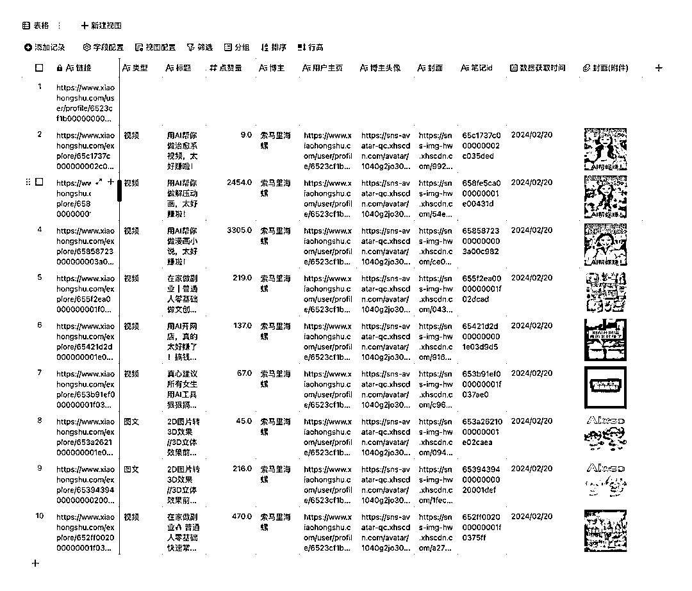
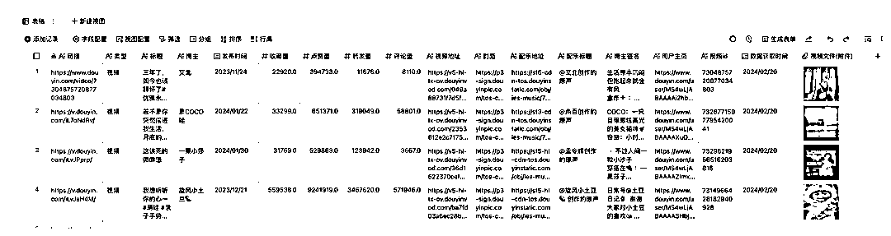
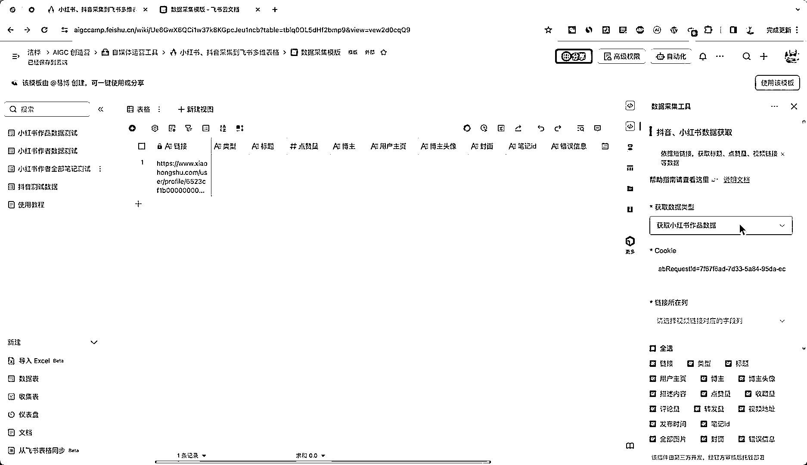

# 开源工具：将小红书和抖音数据保存到飞书多维表格，方便分析和采集

> 原文：[`www.yuque.com/for_lazy/xkrm14/pzcou0t9izvpqwtf`](https://www.yuque.com/for_lazy/xkrm14/pzcou0t9izvpqwtf)

作者： 易博

日期：2024-02-21

点赞数：**143**

* * *

正文：

最近使用小红书采集时，发现采集工具都只能将数据、内容保存成一个表格，而视频、图片都只能展现成一个链接，非常不方便一起分析
于是抽空开发了一个工具，支持将采集到的数据，图片，视频都保存到飞书多维表格。效果可以看下面图片，完美的满足自己小红书采集，抖音采集的需求 项目已开源 地址:
使用教程: 另外现在飞书多维表格插件正在招募中，上线一个可以拿 2000 块，开发流程很简单，半天就能搞一个，可以试试 GitHub -
dida-1894/feishu-douyin-tool: 飞书分析小红书和抖音数...

tool)[`aigccamp.feishu.cn/wiki/LvQRwI1A4iYtnMkOBt...`](https://aigccamp.feishu.cn/wiki/LvQRwI1A4iYtnMkOBtZc2zfsnMd) 

* * *

评论区：

深圳老刘 : 用数据库会不会更方便一些。

易博 : 图片，视频可以和数据一起看到，更加直观

十巷 : 请问下，为什么我的小红书发现页面，点击右键。没有检查，就返回，重新载入页面，将页面存储为，打印页面

易博 : 换个浏览器，最好 chrome

十巷 : 好的谢谢，再整整

虚梦一场， : 这个不能批量添加链接么[害羞]

易博 : 你粘贴的时候，不要双击单元格

虚梦一场， : 我试试谢谢哈

* * *

公众号懒人搜索，懒人专属群分享