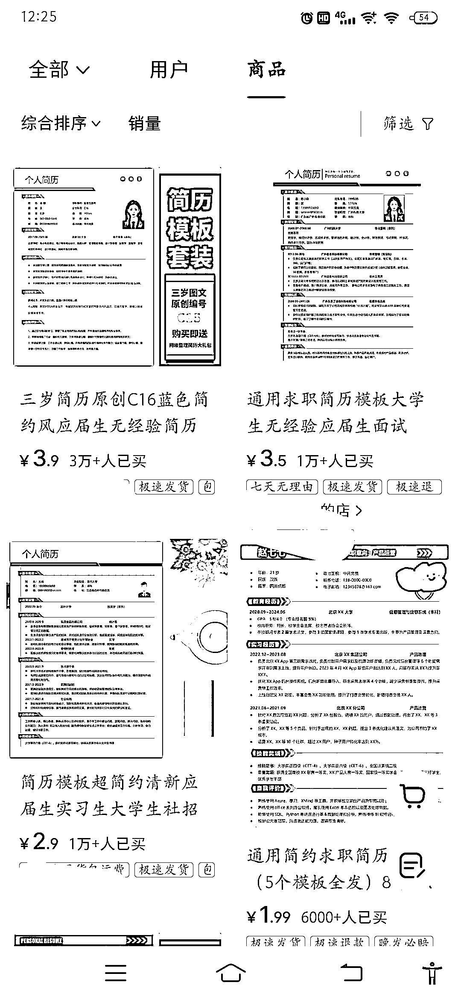
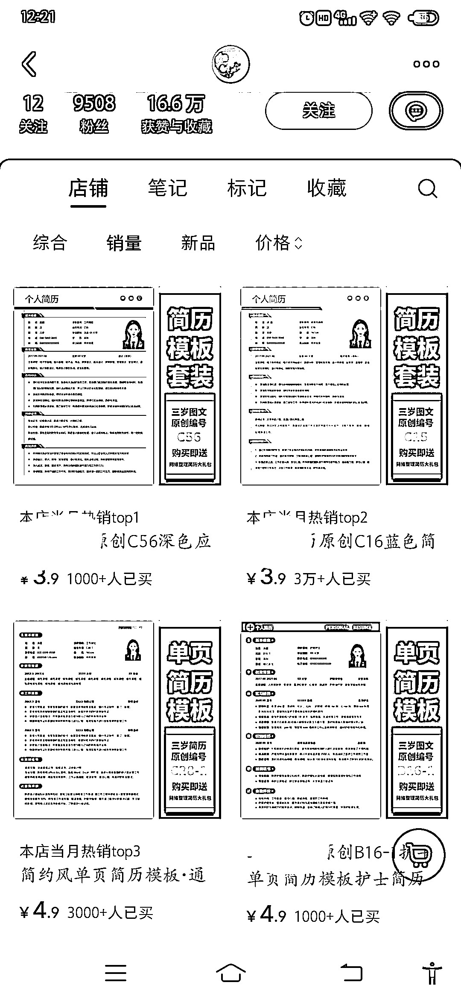
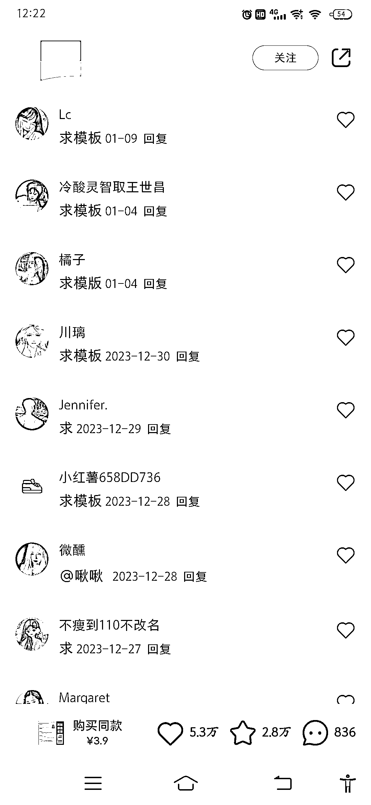
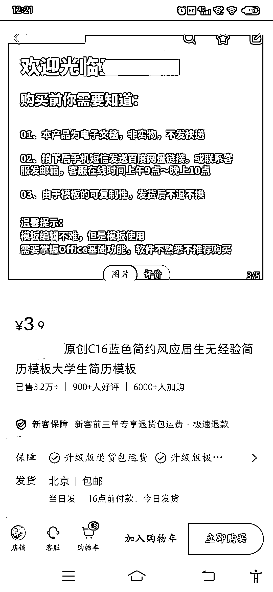
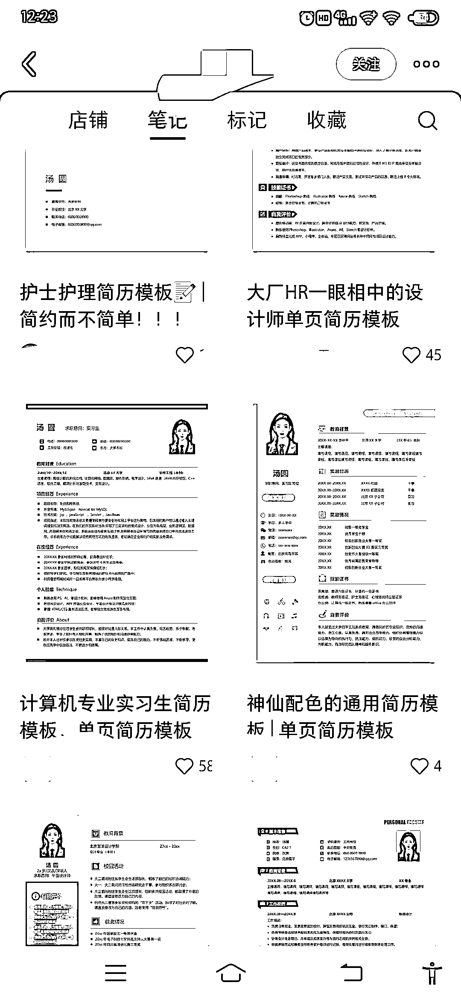

# 求职简历电子版需求大，已卖 4w+销量，定位应届毕业生

> 原文：[`www.yuque.com/for_lazy/xkrm14/qgy1lbnqbkko0ims`](https://www.yuque.com/for_lazy/xkrm14/qgy1lbnqbkko0ims)

作者： 小七

日期：2024-02-19

点赞数：**62**

* * *

正文：

求职简历电子版，需求大。评论区都是求购。
该博主笔记简单，格式固定。定位精准人群应届毕业生，已卖 4w+销量，单价 4－5 元，不退不换。同时，还能赚网盘拉 x 的流量。

* * *

评论区：

夏天 : 这是哪个平台上的呀？谢谢

竹子。 : 看页面是小红书

小七 : 小🍠哦

夏天 : 哦哦，谢谢

大星儿 : 请问这种虚拟产品如何上架至自己的商品店铺中呢

小七 : 看下发的图片，店主有说明

大星儿 : 感谢，我看到店主发货通知了，我是想了解这种虚拟产品是如何上架到店铺的

* * *

公众号懒人搜索，懒人专属群分享