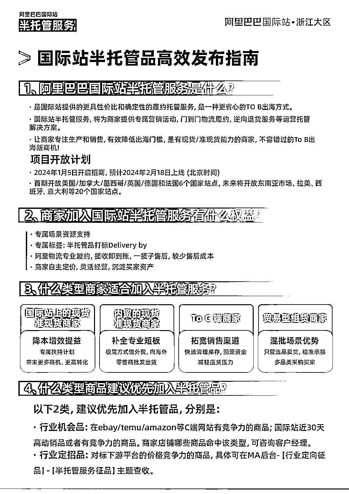
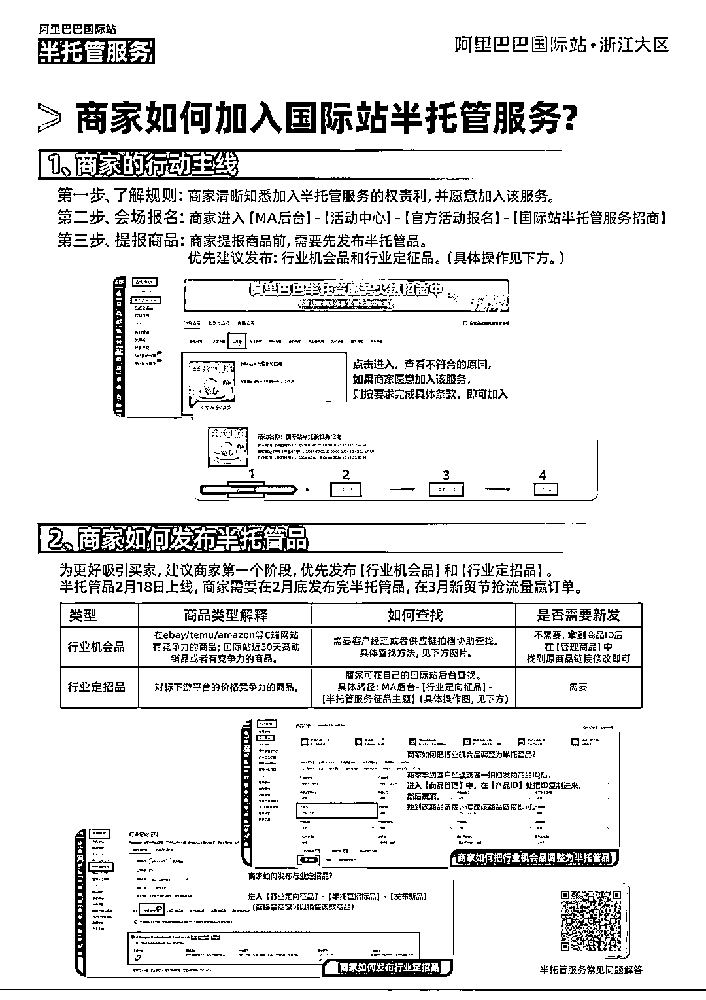

# 阿里巴巴国际站推出半托管服务，首家面向 B 端卖家的平台

> 原文：[`www.yuque.com/for_lazy/xkrm14/cxgqxxuh4x40l07t`](https://www.yuque.com/for_lazy/xkrm14/cxgqxxuh4x40l07t)

作者： heat

日期：2024-02-20

点赞数：**34**

* * *

正文：

阿里巴巴国际站 2 月 18 日上线了“半托管服务”。去年的 temu、速卖通等托管平台都是 to C 端的，阿里国际站是 to B 端的 是第一家。
半托管是卖家自主经营、上架产品、定价、维护库存，说白了就是要有现货。而物流、售后、资金这些繁琐的事情交给了平台

* * *

评论区：

* * *

公众号懒人搜索，懒人专属群分享