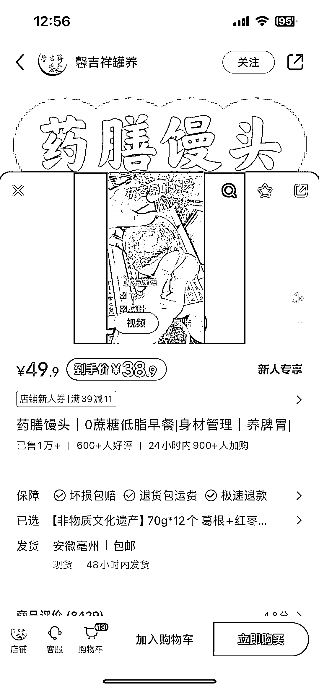
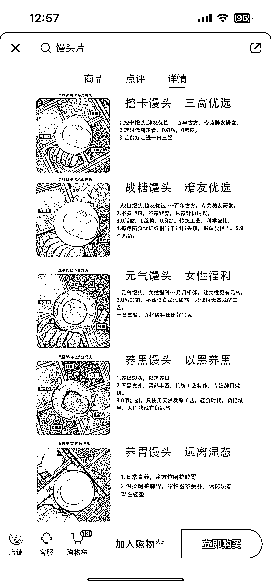
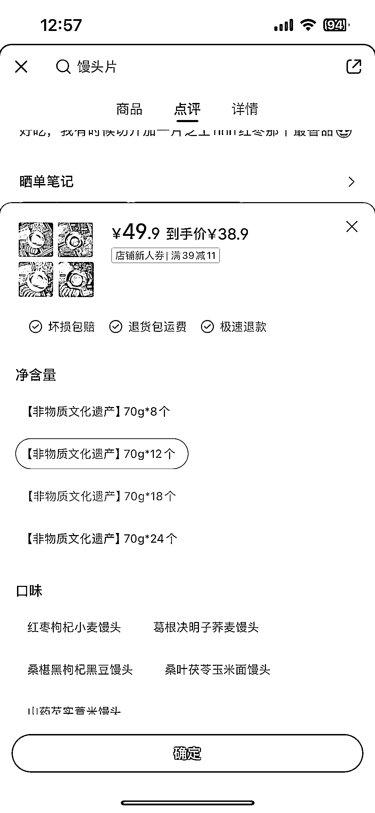
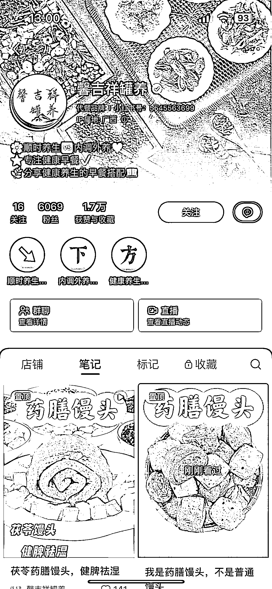

# 药食同源的药膳馒头，一个账号半年赚 40w，粉丝达六千人

> 原文：[`www.yuque.com/for_lazy/xkrm14/fz5kcvzzkvmd6tvi`](https://www.yuque.com/for_lazy/xkrm14/fz5kcvzzkvmd6tvi)

作者： 郑 sir

日期：2024-02-23

点赞数：**105**

* * *

正文：

“药食同源”的药膳馒头，一个馒头三块多，一个账号半年起号六千粉丝，通过馒头这个品变现 40w。

* * *

评论区：

郑 sir : 谢谢亦仁大大

* * *

公众号懒人搜索，懒人专属群分享