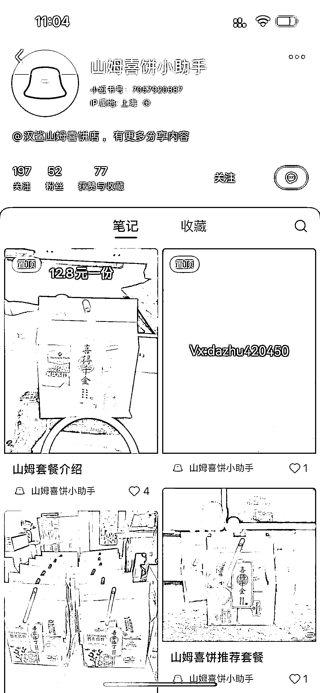
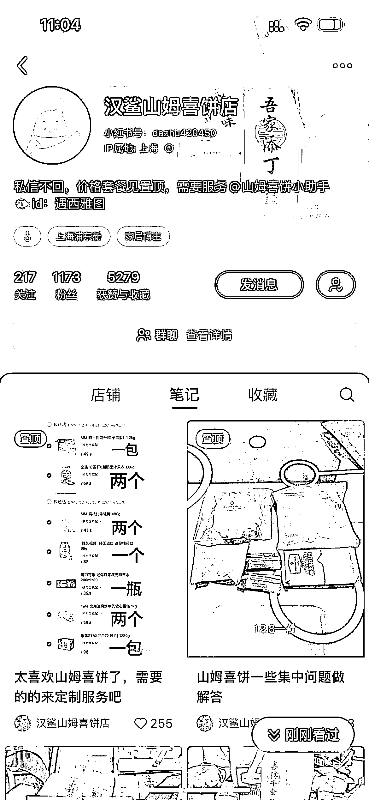
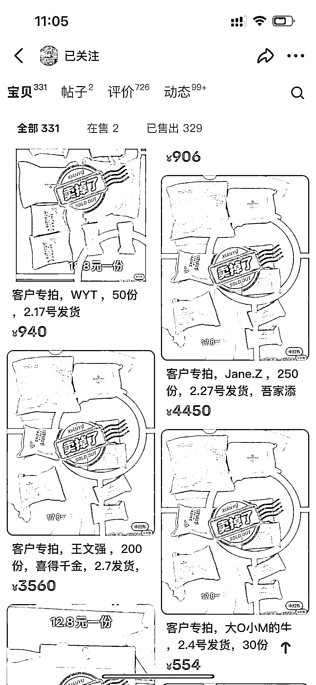
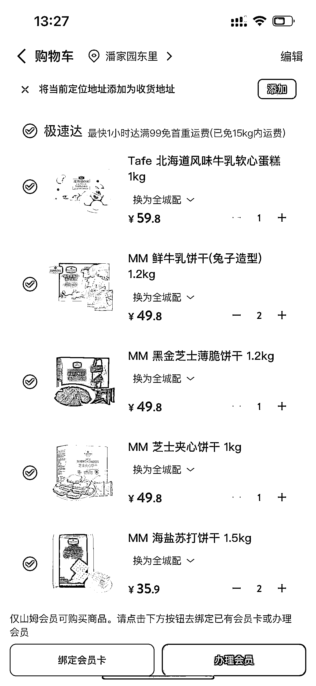
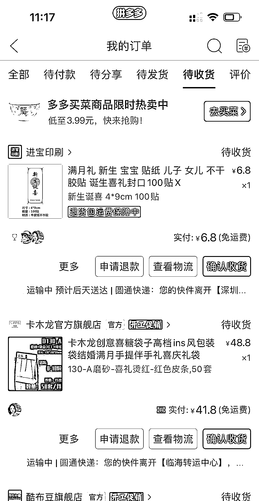

# 山姆喜饼 DIY 礼盒：小成本大利润，品牌价值彰显

> 原文：[`www.yuque.com/for_lazy/xkrm14/nh0s7g31rgr4017m`](https://www.yuque.com/for_lazy/xkrm14/nh0s7g31rgr4017m)

作者： 大蓝蓝

日期：2024-02-23

点赞数：**82**

* * *

正文：

山姆喜饼礼盒制作。产假结束准备喜饼，发现小红书和闲鱼有山姆喜饼 DIY 礼盒，点心成本不超过 6 块，pdd 下单礼盒和贴纸，成本 1 块左右。每一个礼盒利润超过 10 块，买家下单几十上百份，山姆送朋友同事有面子，小成本 DIY 礼盒把品牌价值彰显出来，更彰显礼轻情意重。山姆极速达找闲鱼号免费下单，有山姆店布局城市的朋友可以考虑。

* * *

评论区：

* * *

公众号懒人搜索，懒人专属群分享