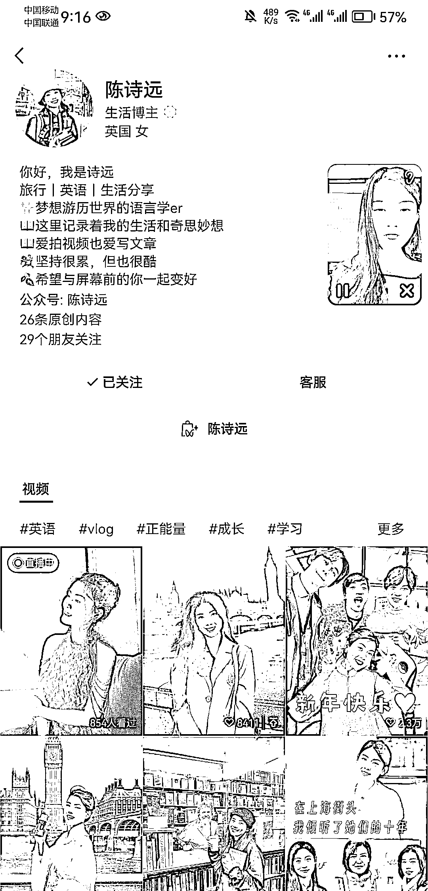
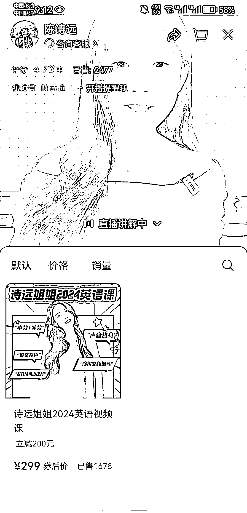

# 英国戏剧表演专业留学生直播卖英语课，3 个月卖出 1678 份，50 万+收入

> 原文：[`www.yuque.com/for_lazy/xkrm14/rdf71nic9wcmciw1`](https://www.yuque.com/for_lazy/xkrm14/rdf71nic9wcmciw1)

作者： 郭茂平

日期：2024-02-23

点赞数：**55**

* * *

正文：

英国戏剧表演专业留学生，视频号粉丝 97 万，直播卖英语课。 每天早上直播 2 小时，直播内容分两部分：1 小时固定英语教学重复讲，1 小时卖课。
目前不到 3 个月，299 的课程卖了 1678 份，50 万+。

* * *

评论区：

老张 : 对了，你提到的视频号粉丝，怎么样可以看得到的，[发呆]

郭茂平 : 是号主自己公布的

老张 : 原来如此，谢谢告知

田新一 : 挺喜欢陈诗远的

阿甜 AI 数字人（克隆* : 小红书的大博主了！温柔可爱的

波叔 : 厉害

* * *

公众号懒人搜索，懒人专属群分享