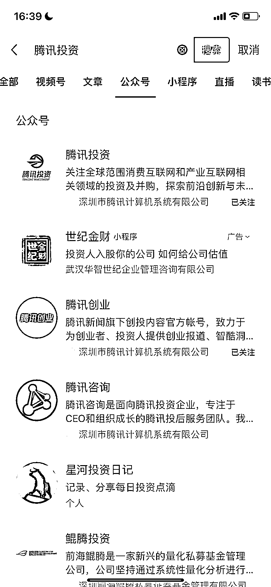
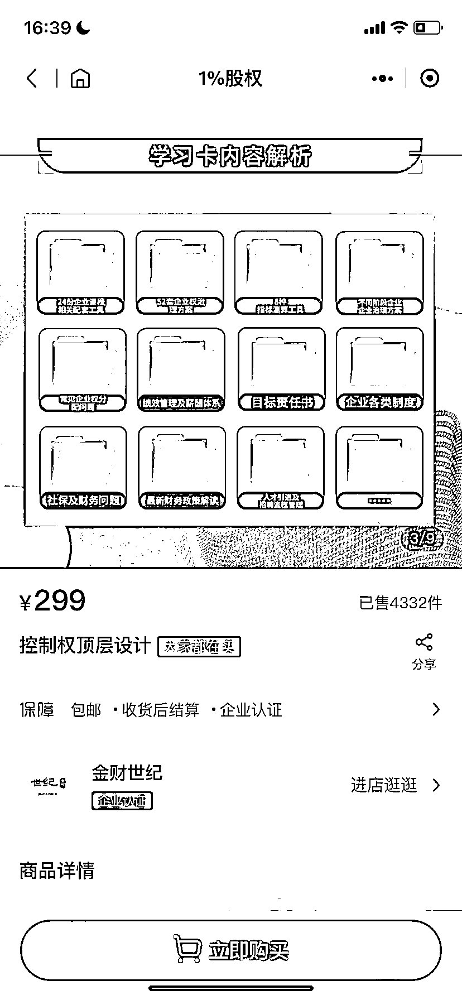

# 小程序销售虚拟资料，销售额近 129.6 万

> 原文：[`www.yuque.com/for_lazy/xkrm14/hb4sbi6lgutigvba`](https://www.yuque.com/for_lazy/xkrm14/hb4sbi6lgutigvba)

作者： 罗破帽

日期：2024-02-19

点赞数：**59**

* * *

正文：

【小程序上卖虚拟资料，销售额近 129.6 万】
a.这家公司在小程序上卖公司相关资料，包括合伙协议、股权分配、企业财务管理等。一份资料卖 299 元，已卖出 4332 件，销售额近 129.6 万。
b.这个小程序是投了广告，4 天前截的图片，到今天仍在投广告，点进小程序，跳转到第二张图的售卖的商品。

* * *

评论区：

热爱 : 已经搜不到了[委屈]

alex : 我 2021 年是在小红书第一个做这个项目的，我一分钱广告没投，也卖了五六千份，之前搜股权的都是我的号，现在鸽不动了

* * *

公众号懒人搜索，懒人专属群分享