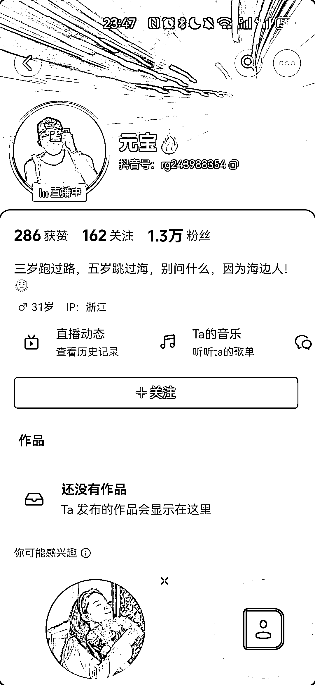
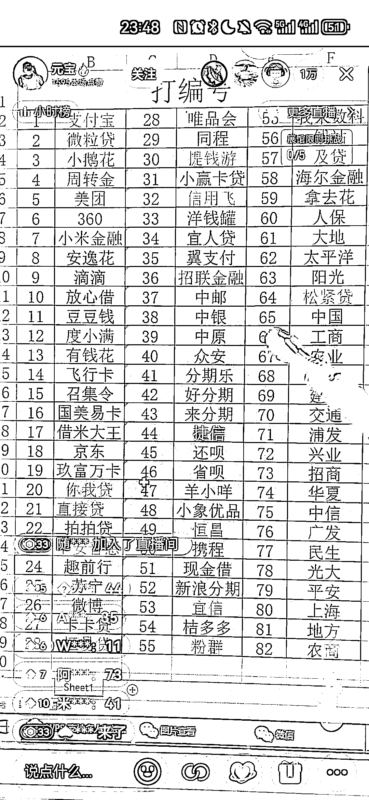
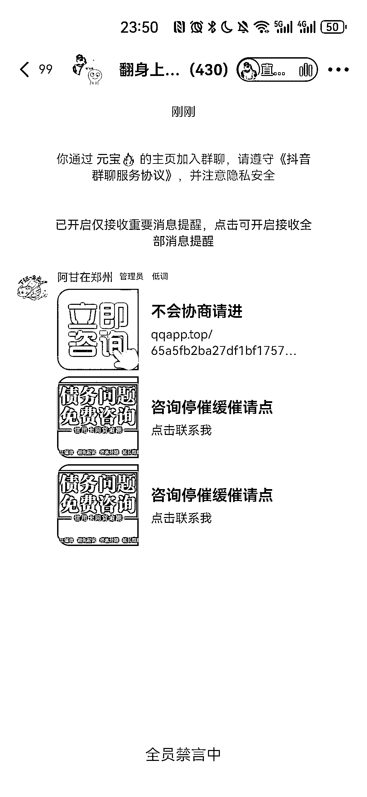
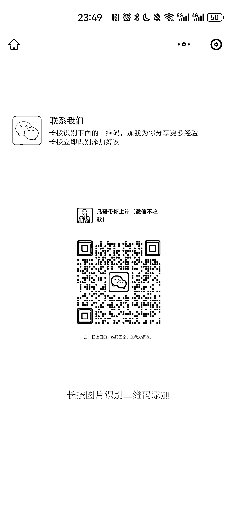
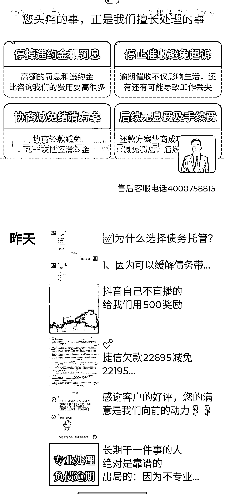
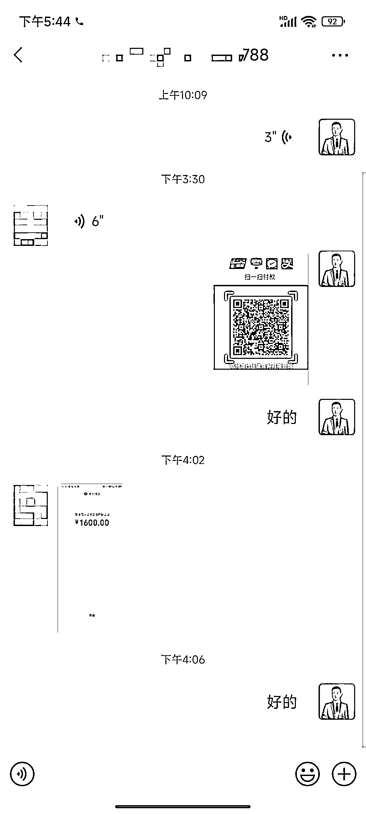

# 抖音直播间债务优化账号吸引大量用户，每天收入 4800 元

> 原文：[`www.yuque.com/for_lazy/xkrm14/dhg6n4wkbn6prxuh`](https://www.yuque.com/for_lazy/xkrm14/dhg6n4wkbn6prxuh)

作者： 希平

日期：2024-02-02

点赞数：**63**

* * *

正文：

做债务优化
昨晚刷抖音直播间，看到好几个 1w 粉左右的账号在直播间，分享了借贷平台的逾期规则，比如中行提前偿能减免 x 月的利息。我看了十几分钟，就有好几个异常值，吸引了我的注意：粉丝 1.6w 但场观 1w，评论区不断有人写下平台的数字，每次主播引导就有十几人进群。
账号：元宝，账号 rg243988354（图 1） 流量：基本不发作品，全靠直播（图 2） 转化：引导进抖音群，在抖音群发抖音卡片（图 3），让用户加微信（图 4）
产品/服务：主要帮用户跟债主（银行、金融平台）协商，停催+减免部分利息+每月按时偿还。 从朋友圈晒单来看（图 5），他一单大概收 1200 元
而且他给用户备注日期，从成交图来看，每天大概成交 3 单，也就是说，每天都有 4800 元收入。

* * *

评论区：

凡森 : 一般的抖音账户还不行 直播得开泛财经资质

希平 : 我问了相关朋友，不用这些资质

凡森 : 是吗？最近同行都在推这个开白技术 我没弄 看来又是割韭菜[捂脸]

乐乐呵呵 : 反催收开始有人进去了

大强哥 : 这种不是反催收，是利用规则和信息差，跟平台协商，停贷停催，同事让客户还钱，只不过少还很多

希平 : 这不是反催收，而是利用银行跟借贷平台的逾期优惠政策，去帮债务人减少债务压力

* * *

公众号懒人搜索，懒人专属群分享