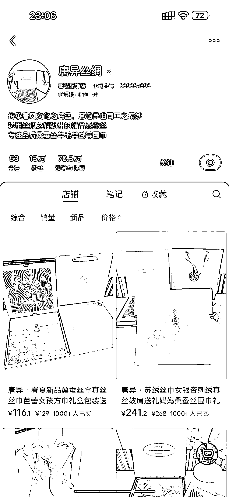
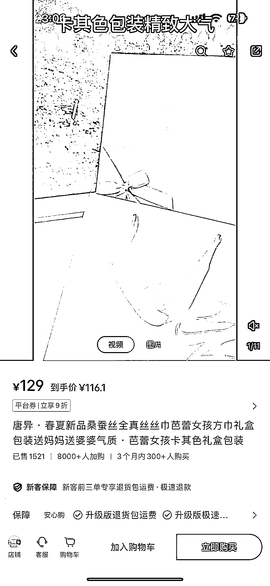
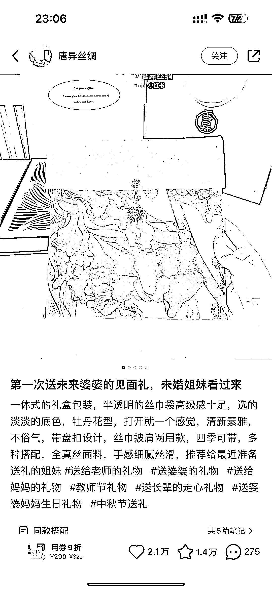
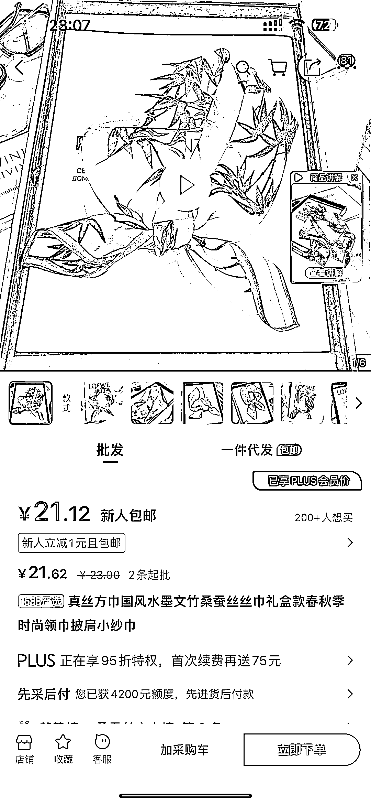

# 小红书发现桑蚕丝丝巾号，垂直细分市场有巨大潜力

> 原文：[`www.yuque.com/for_lazy/xkrm14/xrkb3zmpw5d1oggd`](https://www.yuque.com/for_lazy/xkrm14/xrkb3zmpw5d1oggd)

作者： 九九

日期：2024-01-31

点赞数：**49**

* * *

正文：

小红书看到一个桑蚕丝丝巾号，垂直细分真的吃香。 价差也很吃香。一单 100+利润，图文笔记就可以了。

* * *

评论区：

爱拼才会赢 : 20 买桑蚕丝不太现实啊

佳乐 : 真丝 20 元买的话不太可能吧？

丹娜 : 真丝水太深

逍遥公子 : 可以，质量差，买过一次，容易滑丝，玩玩可以。

李词宝 : 是啊 一次充好 会被退货吧

* * *

公众号懒人搜索，懒人专属群分享