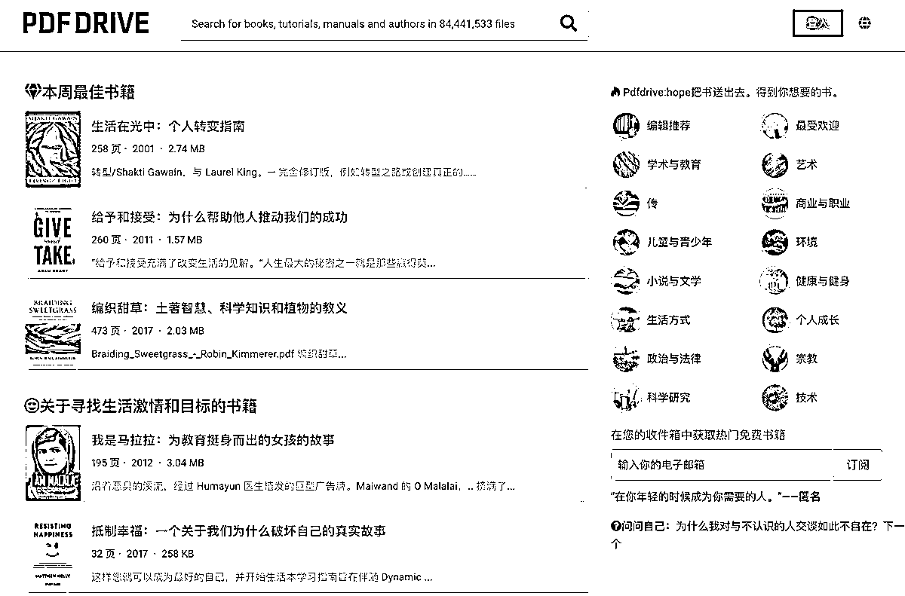

# 免费分享书的网站 PDF Drive，拥有近 7700 万本书籍，支持多种格式下载

> 原文：[`www.yuque.com/for_lazy/xkrm14/sbqkxgaz5h3klp91`](https://www.yuque.com/for_lazy/xkrm14/sbqkxgaz5h3klp91)

作者： 财火

日期：2024-01-31

点赞数：**127**

* * *

正文：

找到一个免费分享书的网站， 拥有近 7700 万本书籍，并且还在不断增长，包括期刊、杂志、指南等各种类型的书籍
最令人高兴的是，它支持 PDF、epub 和 mobi 格式的下载，而且没有烦人的广告和下载限制。这真是对于喜欢阅读的人来说是一个绝佳的资源[PDF Drive -
Search and download PDF files for free...](http://www.pdfdrive.com/)

* * *

评论区：

W.韦同学 : 已收藏[呲牙]

花满楼 : 已收藏

胡二虎🐯 : vlib 不香吗

财火 : 也香，成年人不做选择，全都要。

能不能教我煮汤圆、 : 我有个问题🙋‍♀️为啥我下下来的 PDF 是个链接，怎么能转化为图片呢，我想搞一个电子版的绘本库

* * *

公众号懒人搜索，懒人专属群分享