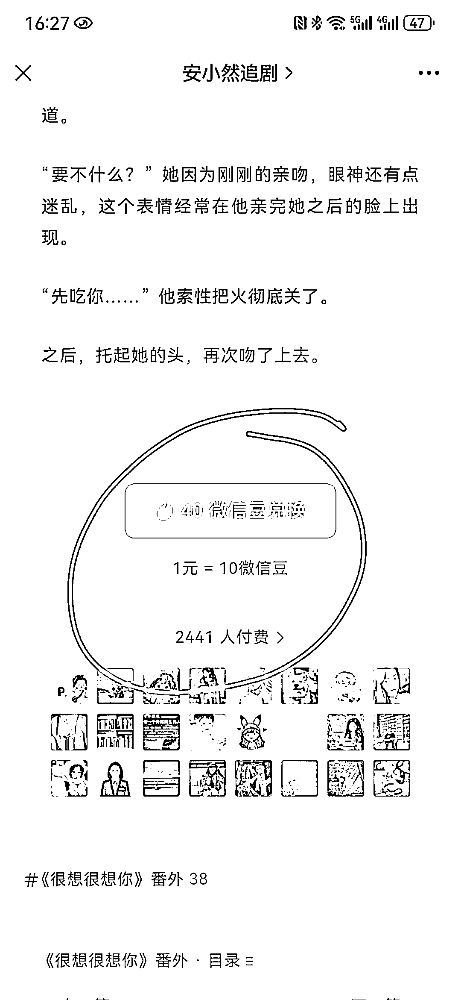
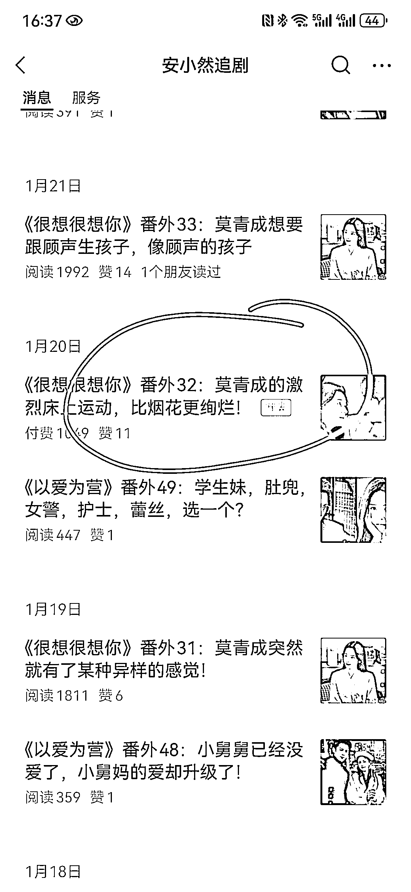

# 剧评号转型成功，热播剧番外赚钱效应惊人

> 原文：[`www.yuque.com/for_lazy/xkrm14/kah4wm8d83md9hs6`](https://www.yuque.com/for_lazy/xkrm14/kah4wm8d83md9hs6)

作者： 文德

日期：2024-01-31

点赞数：**77**

* * *

正文：

今天无意间刷到个剧评号，但不写剧评，专门写热播剧番外，像是长相思，宁安如梦，很想很想你，数据都不错。
我感觉这思路不错，很多人看完剧就想知道结局怎么样了，结局剧里面没给，怎么说随大家便，人类讨厌不确定性，只要给个确定性，就挺好的。
但更重要的是，这个号不仅赚流量主的钱，基本上隔两三天，他就写个带肉的，付费文章。付费 2-4 元，结果付费数据很高，经常有千人以上。

* * *

评论区：

W.韦同学 : 学到了

小七 : 😂

* * *

公众号懒人搜索，懒人专属群分享