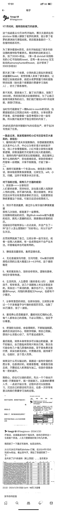
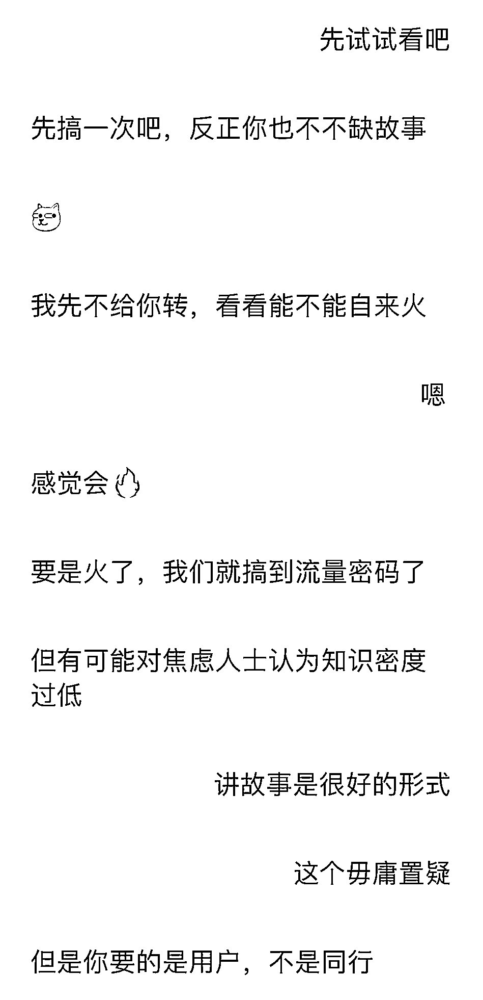
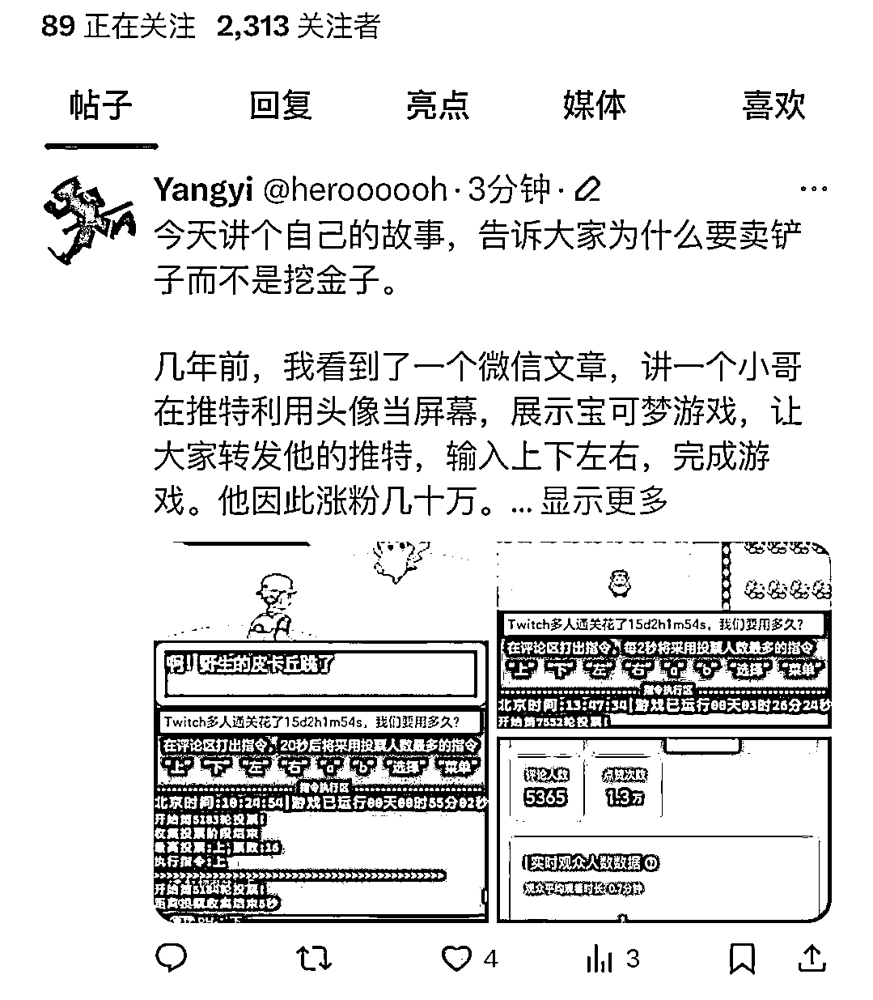
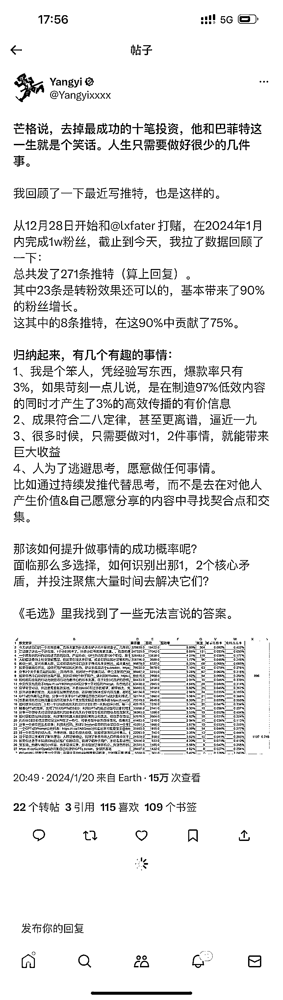
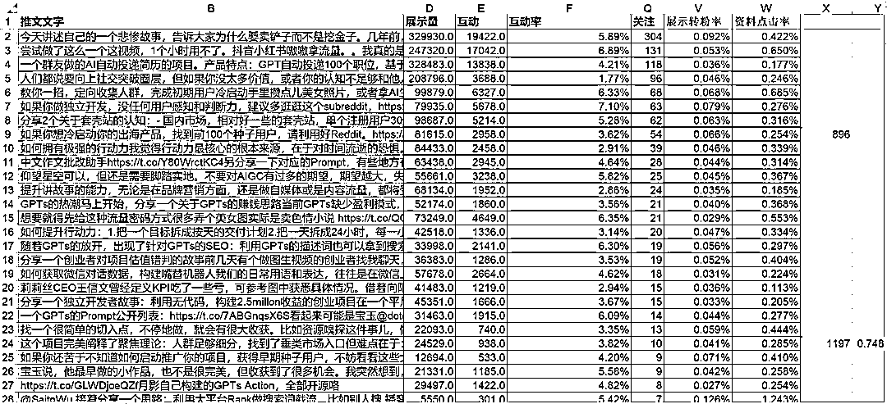

# 拆解一个推特账号的成功之道：流量密码和好友助力

> 原文：[`www.yuque.com/for_lazy/xkrm14/gr42vhbgfra82hhm`](https://www.yuque.com/for_lazy/xkrm14/gr42vhbgfra82hhm)

作者： Comedian

日期：2024-02-01

点赞数：**71**

* * *

正文：

项目拆解 拆解一个推特一个月迅速万粉 AI 商业账号（基础粉丝数未知但肯定不高）。图片内容就是他自己给自己的拆解。学习之前记住两个前提：
第一，他的最开始几条内容是已经经过市场验证，属于“流量密码”，很多人爱看，冷启动成功。
第二，他有一个万粉好友，哪怕内容不够那么顶，帮他冷启动，应该也是一定会做出成绩的。 我之前就很喜欢的那句，他也放在了最后：
【人为了逃避思考，愿意做任何事情】 比如通过持续发推代替思考，而不是去在对他人产生价值&自己愿意分享的内容中寻找契合点和交集。

* * *

评论区：

Comedian : ID@Yangyi，从 23 年 12 月 28 号到 1 月 20 号。再次证明 AI 一定要出海，在国内你去轻资产做 AI 会被抄袭的妈都不认识了。

奔腾 : 内容在渠道中流通，所以把表格的前三个标题用浏览器搜索了下，一个网站有转发，做的夸克拉新，有公众号转发，有微博转发，某音类平台未搜索[呲牙]

* * *

公众号懒人搜索，懒人专属群分享