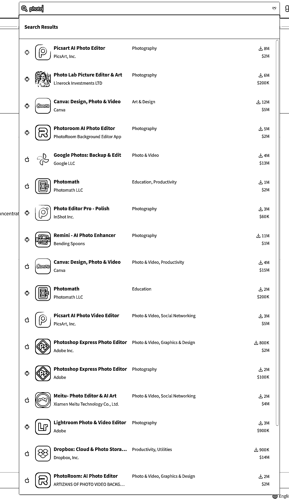

# 如何快速获取一个 App 的每月下载量和收入数据

> 原文：[`www.yuque.com/for_lazy/xkrm14/bu1f6b95u0gygq5a`](https://www.yuque.com/for_lazy/xkrm14/bu1f6b95u0gygq5a)

作者： 哥飞

日期：2024-02-01

点赞数：**72**

* * *

正文：

如何快速知道一个 App 的每月下载量和大概收入？ 哥飞教大家一个很简单的办法，不需要登录注册当然也不收费。 打开
，直接在右上角搜索框输入 App 名称，看下拉列表的结果即可。
右侧会出来两个数字，带下载图标的是估算的每月下载量，下面带美元符号的是估算的每月收入。[`app.sensortower.com/`](https://app.sensortower.com/) 

* * *

评论区：

认知小窗-认哥 : 收入数不准吧，买的什么套餐，有的月卡有的年卡，有的自动续费，有的中途取消，很难详细了解

哥飞 : 都说了估算，当然不可能百分百准确，但是足够有参考价值了。

* * *

公众号懒人搜索，懒人专属群分享