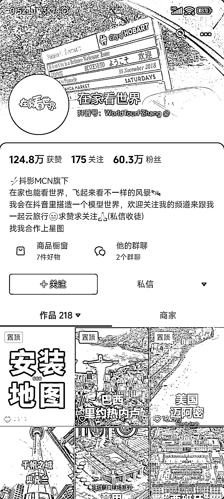

# 利用谷歌地球直播家乡风景，创造纯利润的虚拟课程

> 原文：[`www.yuque.com/for_lazy/xkrm14/sy0k9p6sprggr9hh`](https://www.yuque.com/for_lazy/xkrm14/sy0k9p6sprggr9hh)

作者： 物女金

日期：2024-01-30

点赞数：**87**

* * *

正文：

找一个谷歌地球的安装教程，学会以后下载到手机 上，然后去知识付费晓程序开通讲师，比如充电课 堂，豆包都知道是免费的，创建--个课程就叫三维
地图安装教程，定价不要太高，20 至 80 就可以然 后挂.上课程开直播，这个软件可以从天空看到地 面，直播主题就是帮粉丝看家乡，很多人会在直播
间互动，说自己的家乡在哪里，让主播放大了去， 然后在直播过程中引导大家买这个教程。大多数人 不知道这个软件是免费的，就会花钱买虚拟课程，
卖出去都是纯利润，有人靠这个做了几十万粉丝。

* * *

评论区：

郭少飞-日拱一卒 : 估计变现不动吧。账号停更 2 年了，思路是好

* * *

公众号懒人搜索，懒人专属群分享