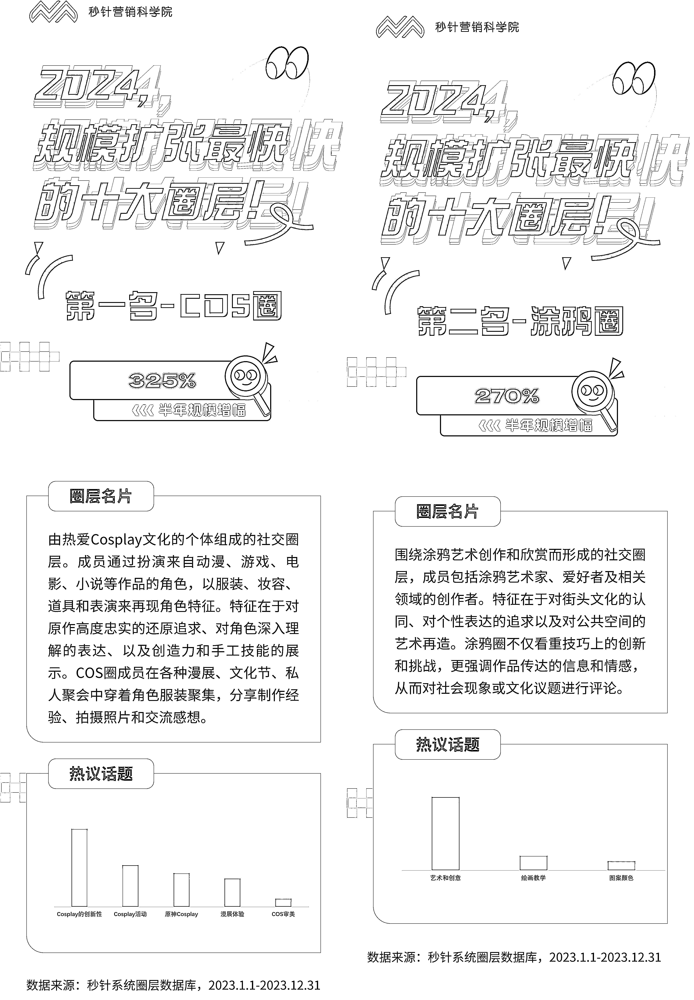
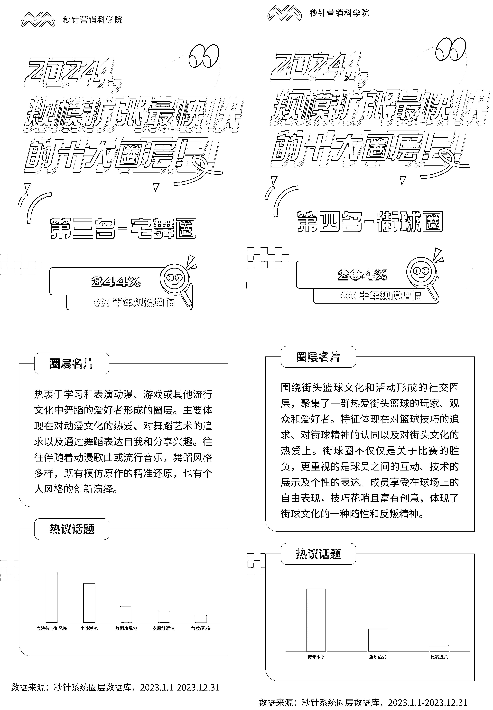
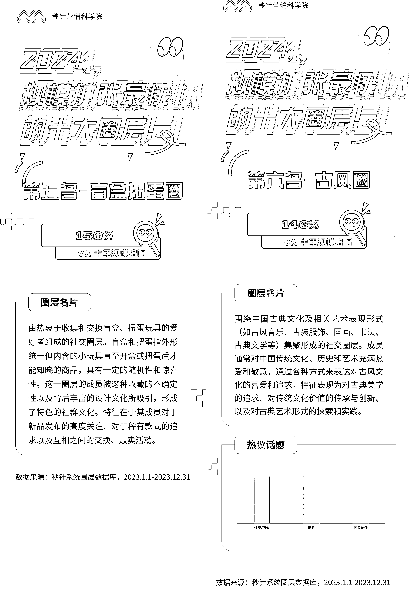
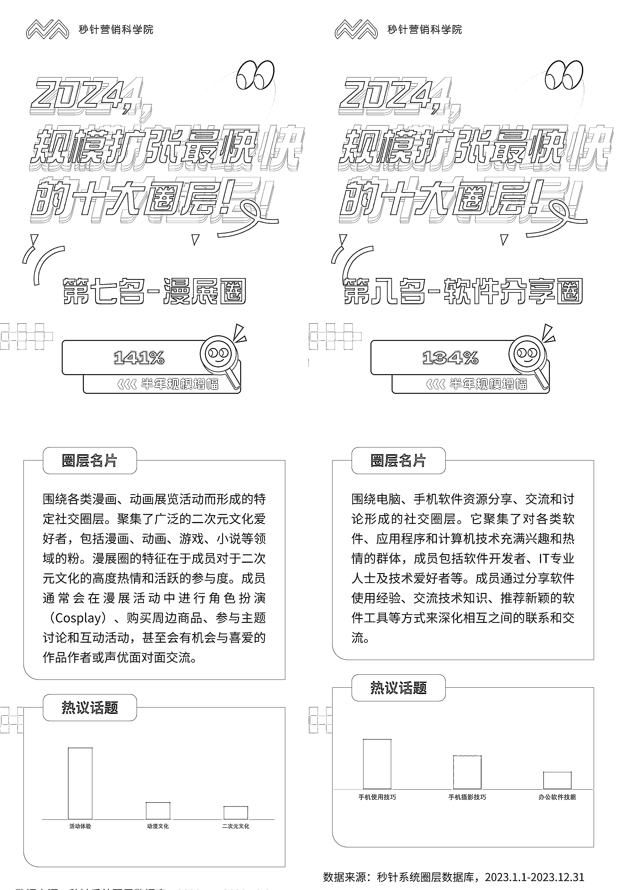
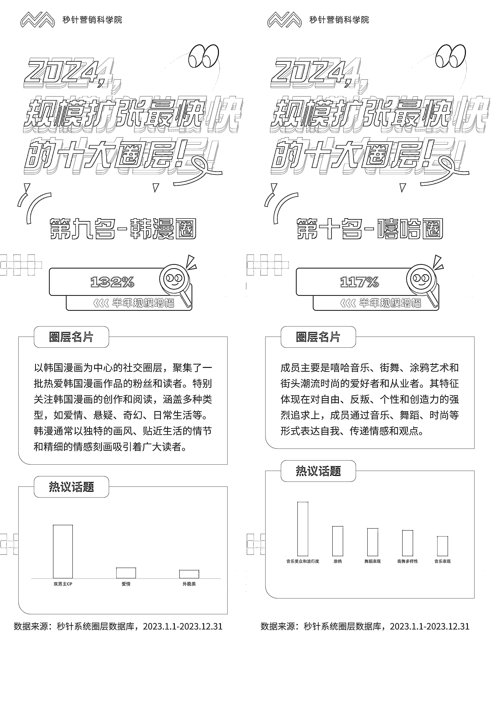

# 2024 年，崛起中的小圈层

> 原文：[`www.yuque.com/for_lazy/xkrm14/foiwq0gk3em57i5z`](https://www.yuque.com/for_lazy/xkrm14/foiwq0gk3em57i5z)

作者： 脑海中的橡皮擦

日期：2024-02-01

点赞数：**66**

* * *

正文：

2024，那些不起眼但正快速崛起的“小圈层”
圈层，指因兴趣、爱好、价值观、社会属性等共性特征而集聚，具有一定文化认同感或共性目标的社群或部落。当下，圈层主要在各种社交媒体中聚集。
圈层具有天然的营销属性，是小众引领大众的典型： ◾ 对外：它有明显的特征和标签，神秘又有趣味； ◾ 对内：它又有属于本部落的独特价值观，成员活跃且高认同。
聚集在社媒平台中的圈层，其影响力也遵循社媒平台的反漏斗模型，即从核心人群/KOL 逐步向外扩展至高相关人群、次相关人群，最终扩展至泛人群。
围绕其进行的营销，一定程度上也遵循「创新的扩散曲线」，即圈层内人群作为创新者或早期采纳者，会影响早期采用人群，决定整个创新产品的扩散程度。
所以，在社媒的语境下，人群定位必须考虑圈层，寻找流量和内容机会，也可以从圈层入手。

* * *

评论区：

佳乐 : 每个圈层能不能创建地区微信群创建私域流量？

脑海中的橡皮擦 : 首先你要找到这些圈层聚集的地方

木木林 : 这些圈层聚集在哪里呀

晓添 : 这个挺有意思的，垂直赛道有很多机会啊[呲牙]

* * *

公众号懒人搜索，懒人专属群分享