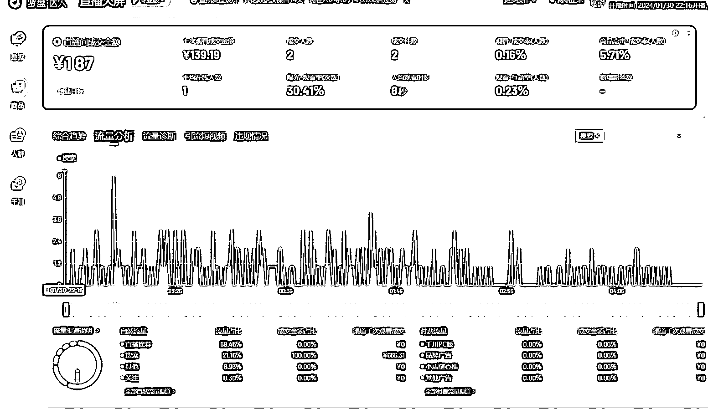

# 无人直播项目：通过搜索指数大但带货人相对较少的产品获取流量

> 原文：[`www.yuque.com/for_lazy/xkrm14/rp72pabkk1m9girx`](https://www.yuque.com/for_lazy/xkrm14/rp72pabkk1m9girx)

作者： 谢同学

日期：2024-01-31

点赞数：**59**

* * *

正文：

近期测试了无人直播项目，通过相关工具如考古加和巨量算数结合，找出搜索指数大，但带货人相对较少的产品，通过批量添加产品在直播间堆关键词获得搜索展示量的机会获取流量，再通过无人直播长时间挂机，像我这样没做过直播的新人一样可以获得成交。做得好的同行佣金依然可以过千，想要做直播的可以看看。

* * *

评论区：

* * *

公众号懒人搜索，懒人专属群分享