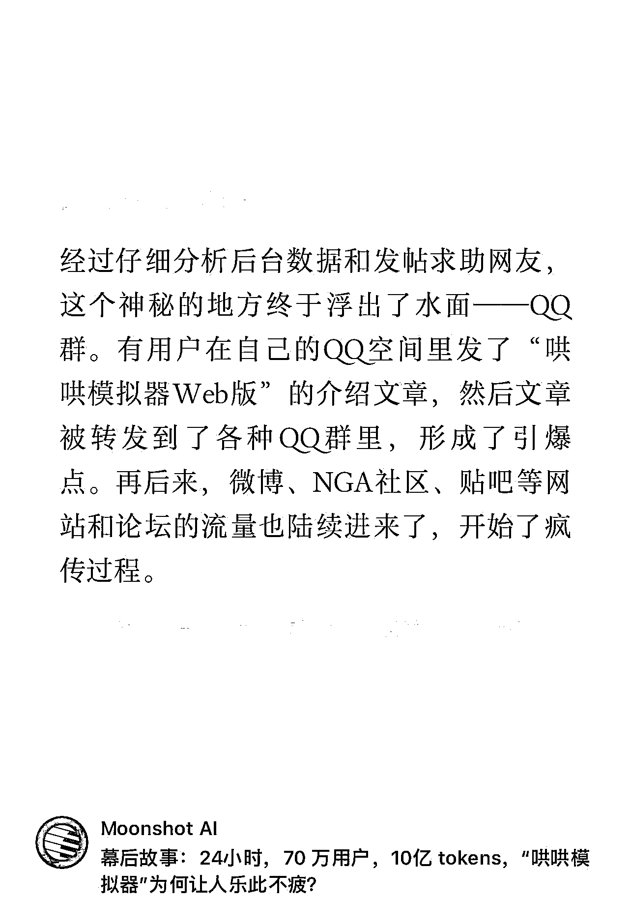

# 揭秘“哄哄模拟器”：24 小时内吸引 70 万用户

> 原文：[`www.yuque.com/for_lazy/xkrm14/uhu34mqf30cl1hub`](https://www.yuque.com/for_lazy/xkrm14/uhu34mqf30cl1hub)

作者： 罗破帽

日期：2024-02-01

点赞数：**40**

* * *

正文：

a.幕后故事：24 小时，70 万用户，10 亿 tokens，“哄哄模拟器"为何让人乐此不疲？
b.经过仔细分析后台数据和发帖求助网友，这个神秘的地方终于浮出了水面一 QQ 群。有用户在自己的 QQ 空间里发了“哄哄模拟器
Web 版”的介绍文章，然后文章被较发到了各种 QQ 群里，形成了引爆点。再后来，微博、NGA 社区、贴吧等网站和论坛的流量也陆续进来了，开始了疯传过程。
注释：还有之前火过的秒鸭/美图/视频等二创类产品，QQ 是冷启动的流量源头，里面是一群有时间，愿意接受新事物的初/高/大学生。

* * *

评论区：

* * *

公众号懒人搜索，懒人专属群分享