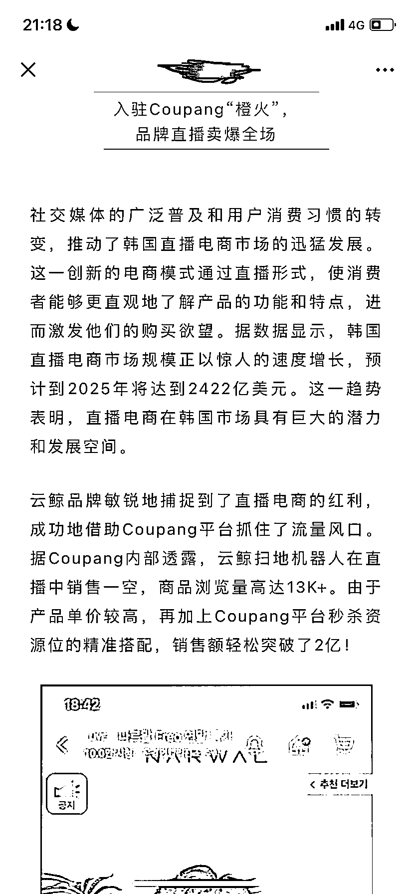
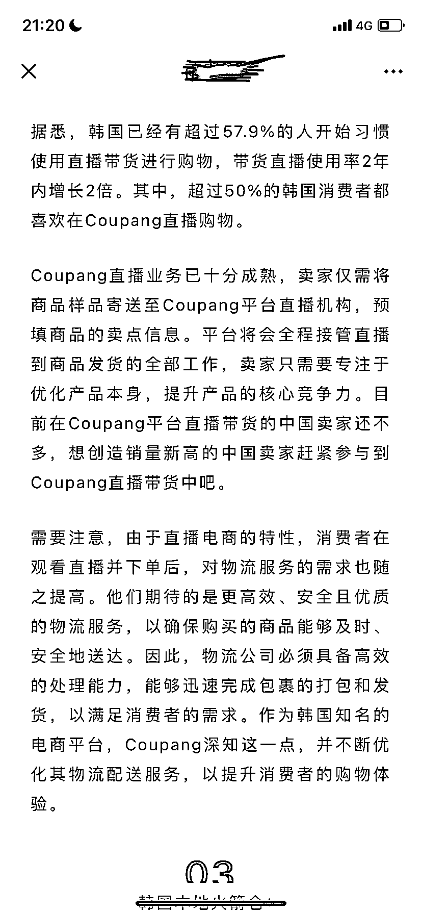

# 韩国直播电商市场蓬勃发展，带货直播成主流趋势

> 原文：[`www.yuque.com/for_lazy/xkrm14/nof1dgciph9gm46l`](https://www.yuque.com/for_lazy/xkrm14/nof1dgciph9gm46l)

作者： 罗破帽

日期：2024-01-31

点赞数：**37**

* * *

正文：

a.数据显示，韩国直播电商市场规模正以惊人的速度增长，预计到 2025 年将达到 2422 亿美元。这一趋势表明，直播电商在韩国市场具有巨大的潜力和发展空问。
b.据 Coupang 内部透露，云鲸扫地机器人在直播中销售一空，商品浏览量高达 13K+。由于产品单价较高，再加上 Coupang 平台秒杀资源位的精准搭配，销售额轻松突破了 2 亿！
c.据悉，韩国已经有超过 57.9%的人开始习惯使用直播带货进行购物，带货直播使用率 2 年内增长 2 倍。其中，超过 50%的韩国消费者都喜欢在 Coupang 直播购物。

* * *

评论区：

* * *

公众号懒人搜索，懒人专属群分享