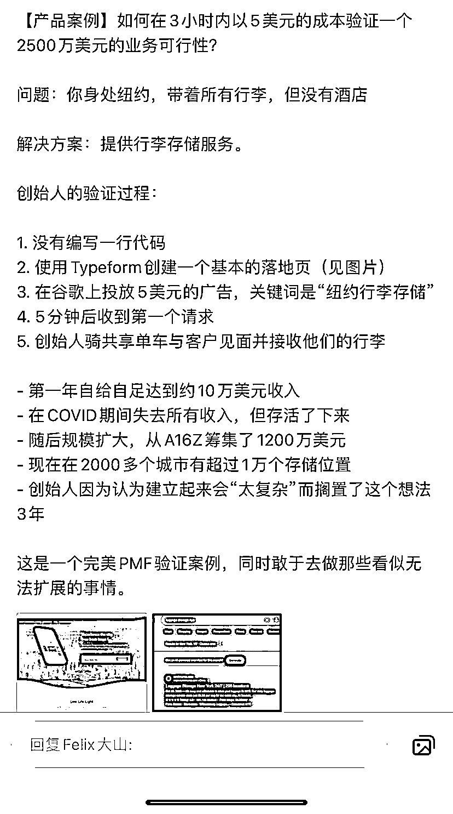

# 以 5 美元成本验证 2500 万美元业务可行性的方法：行李存储服务的创始人的故事

> 原文：[`www.yuque.com/for_lazy/xkrm14/nyngy6e9lak3h353`](https://www.yuque.com/for_lazy/xkrm14/nyngy6e9lak3h353)

作者： 罗破帽

日期：2024-01-29

点赞数：**36**

* * *

正文：

如何在 3 小时内以 5 美元的成本验证一个 2500 万美元的业务可行性？ 问题：你身处纽约，带着所有行李，但没有酒店 解决方案：提供行李存储服务。
创始人的验证过程： 1\. 没有编写一行代码 2\. 使用 Typeform 创建一个基本的落地页（见图片）
3.在谷歌上投放 5 美元的广告，关键词是“纽约行李存储” 4.5 分钟后收到第一个请求 5\. 创始人骑共享单车与客户见面并接收他们的行李
①第一年自给自足达到约 10 万美元收入 ②在 COVID 期问失去所有收入，但存活了下来 ③随后规模扩大，从 A16Z 筹集了 1200 万美元 ④现在在 2000
多个城市有超过 1 万个存储位置 ⑤创始人因为认为建立起来会“太复杂”而搁置了这个想法 3 年

* * *

评论区：

* * *

公众号懒人搜索，懒人专属群分享