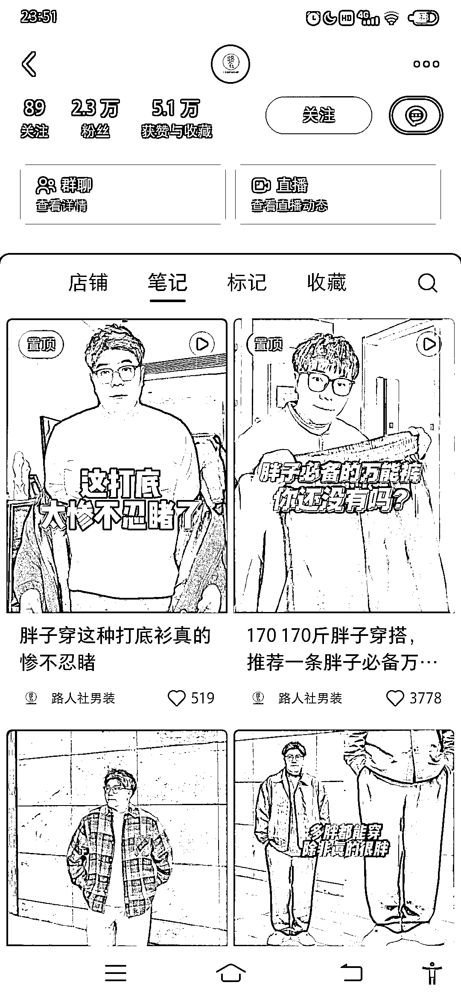
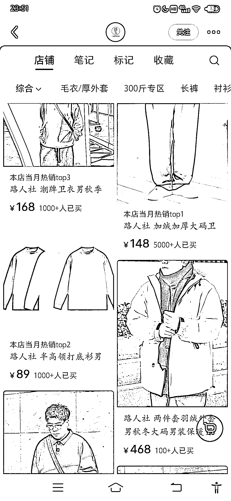
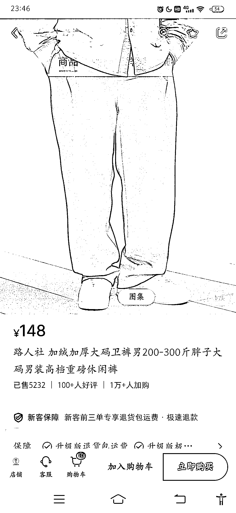
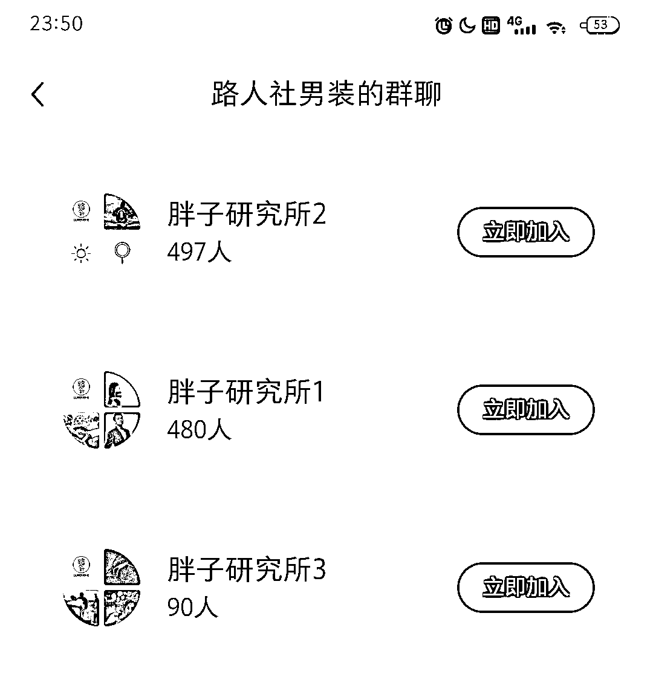

# 微胖大码男生服装，休闲风，销售火爆，有巨大商机

> 原文：[`www.yuque.com/for_lazy/xkrm14/uyuwnsgqz8gvywnv`](https://www.yuque.com/for_lazy/xkrm14/uyuwnsgqz8gvywnv)

作者： 小七

日期：2024-01-31

点赞数：**39**

* * *

正文：

微胖大码男生服装(定位，170 到 300 斤)，休闲风 2022 年底发的笔记。
价位 148 元，其中一条裤子卖了 5000+，还有 1 万+加购，销售额就 75w。拼多多只搜到一家这个单品，进价 40 元。 其他 100+元左右单衣大多 1000+。
300－500 元价位的，也有过百销量。 群聊已经 1000+人了，维护好可以有不停地长尾购买。 推荐: 1.大码人群的痛点主要是能穿-
显瘦，选择范围相对有限，退货率偏低。 2.男生比女生退货低，怕麻烦等… 3.视频拍摄简单，都是直接说出品能解决胖男生的痛点。 延伸:
这个博主抖音，淘宝都有店，品一样，销量各平台比较平均。精准人群购买力强。 那么，是不是可以选一些更细分人群的品，关键词“大码”+，去扩展。

* * *

评论区：

* * *

公众号懒人搜索，懒人专属群分享