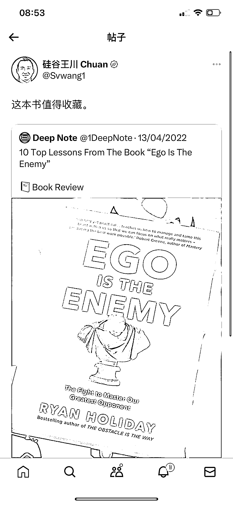
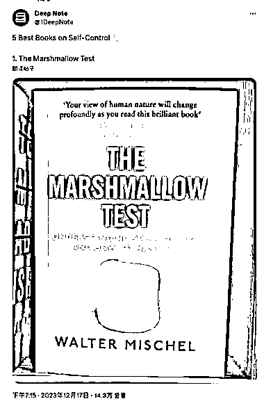
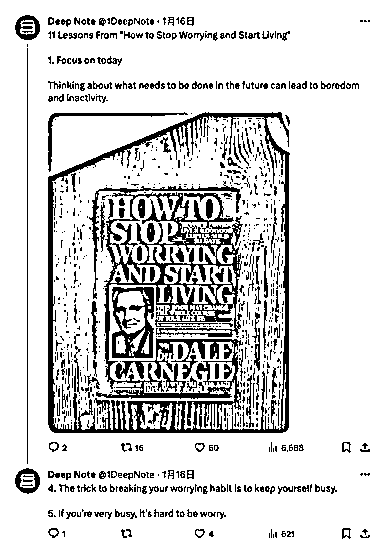
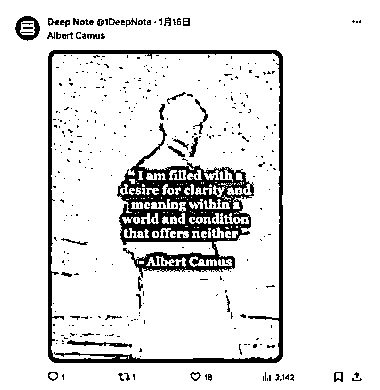
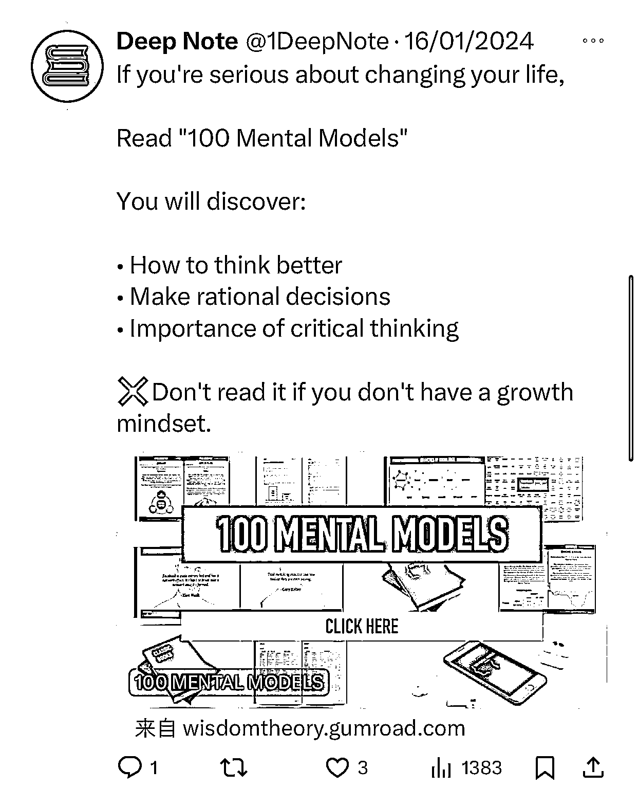
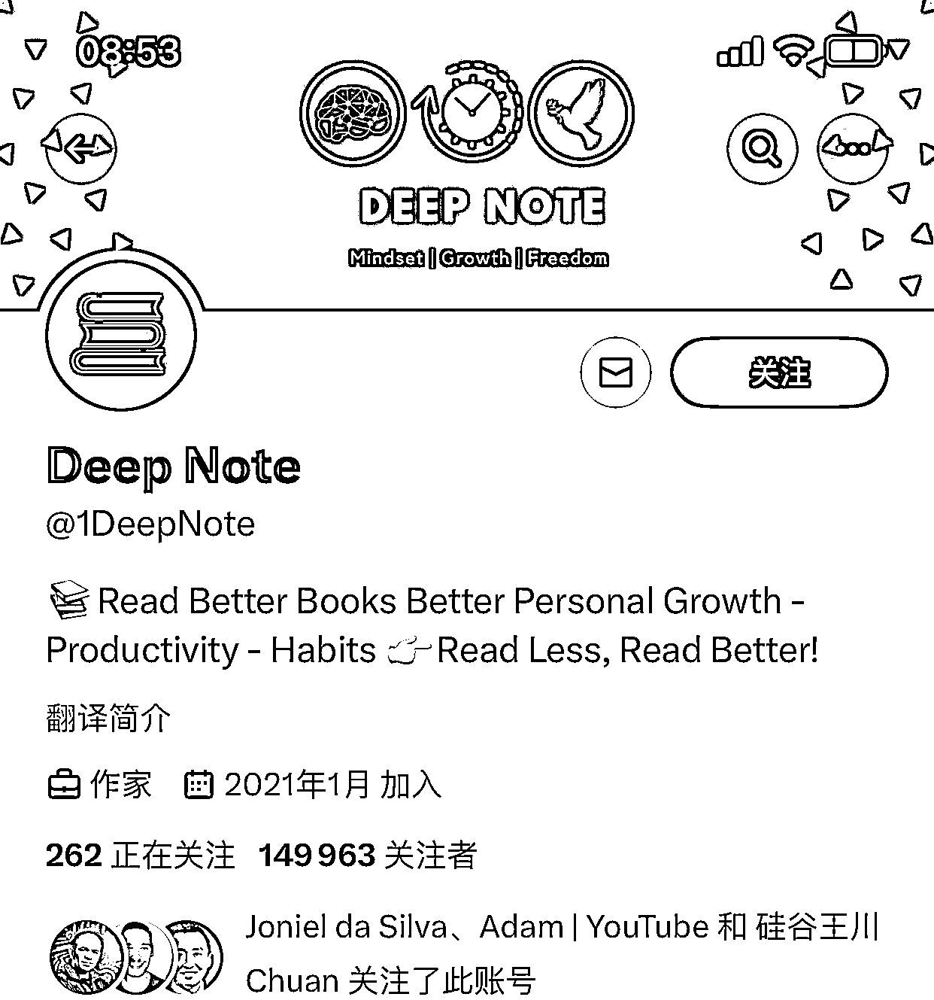

# 普通人也能在 X 赚钱的商业模式：利用 Gumroad 进行知识付费

> 原文：[`www.yuque.com/for_lazy/xkrm14/wnygb4u97ii34l0n`](https://www.yuque.com/for_lazy/xkrm14/wnygb4u97ii34l0n)

作者： 林林 AIGC 写作

日期：2024-01-29

点赞数：**35**

* * *

正文：

因为硅谷王川大佬的转发我发现了一个普通人也能在 X（原 Twitter）赚到钱的商业模式。就像这个 2021 年 1 月才注册的账号一样，这个账号用图文并茂的方式分享了很多优质干货，不是读书笔记就是书单，要么就是名人名言。变现的话就是引流到站外知识付费平台 Gumroad。
据了解 Gumroad 是一个电子商务平台，允许创作者直接向其受众出售产品。该平台由 Sahil
Lavingia 在 2011 年创建，位于加利福尼亚州的旧金山。Gumroad 使创作者能够销售数字产品，例如电子书，音乐，视频，软件和实体商品。该平台为创建者提供了创建自定义登录页面，跟踪销售和处理付款的工具。

* * *

评论区：

倪大胖 : 请问引流到 gumroad 具体卖啥啊

林林 AIGC 写作 : 类似于小报童的付费专栏

倪大胖 : Soga 好嘞 谢谢。那和小红书的参考阅读室类似。

林林 AIGC 写作 : 那个卖了 6000 多份了，交付方式是用 notion 专栏

* * *

公众号懒人搜索，懒人专属群分享