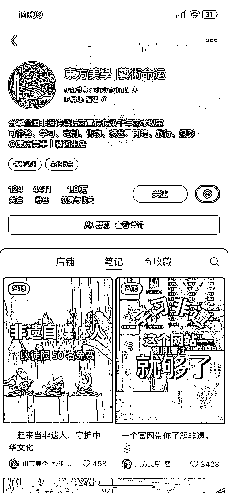
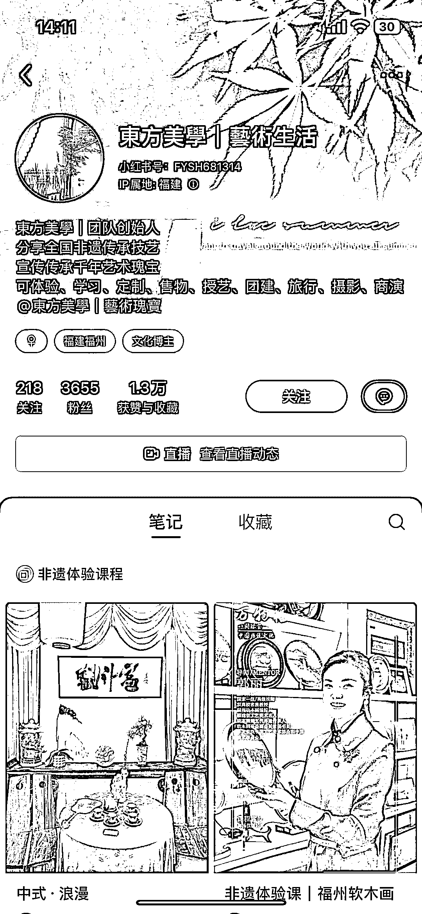
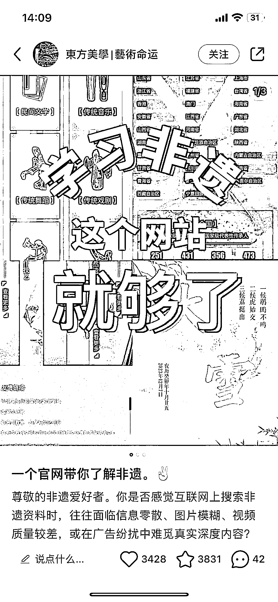

# 非遗文化创业项目，满足旅游和学习需求

> 原文：[`www.yuque.com/for_lazy/xkrm14/zukvp7xneplixek5`](https://www.yuque.com/for_lazy/xkrm14/zukvp7xneplixek5)

作者： 地藏

日期：2024-01-29

点赞数：**29**

* * *

正文：

目标人群：对非遗文化感兴趣的人，喜欢非遗景点旅游的人，想通过非遗文化创业的人 需求：满足旅游爱好者的旅游需求，创业者找项目需求，文化爱好者学习需求
平台：小红书平台发布非遗资料，非遗旅游景点介绍，非遗体验课来引流到小红书群 盈利：没有具体估算，但是看他笔记数据，应该不错。
我从来没想过非遗这个行业还能做这么多项目

* * *

评论区：

小七 : 怎么感觉跟手作人可以链接

地藏 : 是的小七老师

* * *

公众号懒人搜索，懒人专属群分享