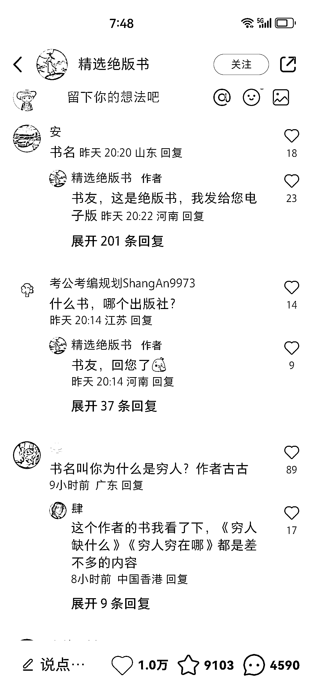
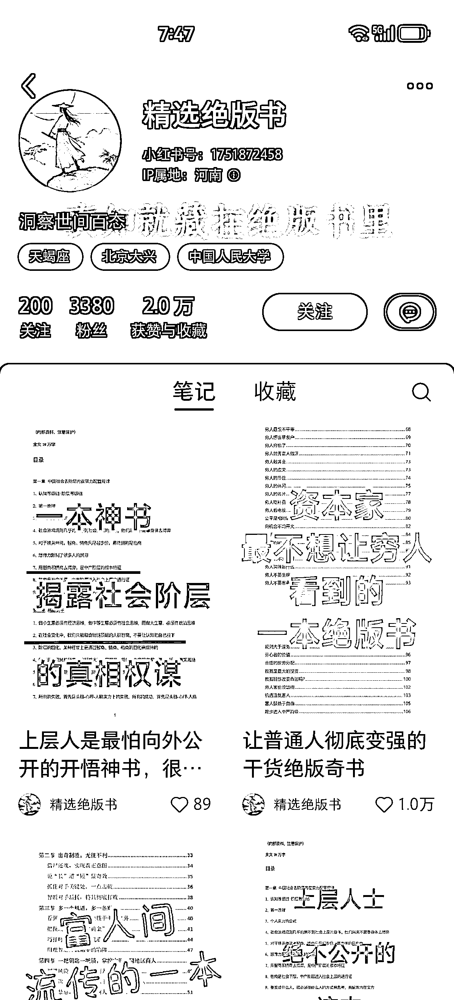

# 小红书成为新的书单号，如何变现这一趋势？

> 原文：[`www.yuque.com/for_lazy/xkrm14/yfeozzfhoxedktte`](https://www.yuque.com/for_lazy/xkrm14/yfeozzfhoxedktte)

作者： 嘻嘻｜溪溪

日期：2024-02-08

点赞数：**43**

* * *

正文：

这应该是又一种形式的书单号吧，绝版书，绝这字在抖音是违禁词，小红书好像不管啊，私信很多，我也加了，这类电子素材挺多的，我都想做了，这个复制不难，后续如何变现，我能想到一个点，迫切想赚钱的人群[微笑]才是真的会舍得花钱投资自己的。

* * *

评论区：

奇奇 : 变现的话可能是引流到私域，发个书单，单独一本免费送，如果全部打包只要 9.9？类似这样的？我猜

蘑菇🍄阿姨 : 我今天也看了，他还没回我，先看看他的路径[呲牙]

逍遥公子 : 坐等结果，看到有人已经揭秘答案。

嘻嘻｜溪溪 : 引导私域，但是后面还是得有更高单价的

嘻嘻｜溪溪 : 一起分享下呀

倪大胖 : 这种感觉不是真的绝版书，就是自己编的鸡汤（看的很有道理，但对改变现实没什么帮助），打出稀缺的宣传，私域卖虚拟卖课卖社群

* * *

公众号懒人搜索，懒人专属群分享