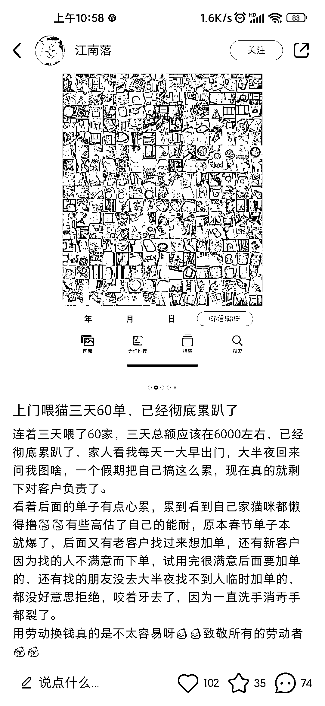
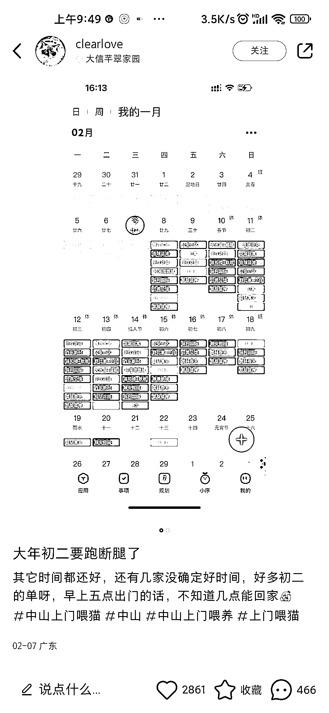
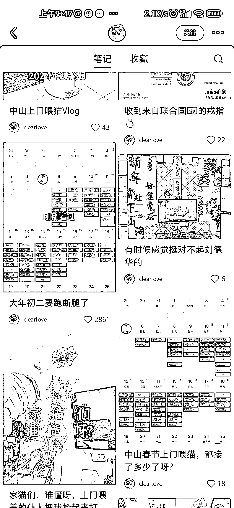
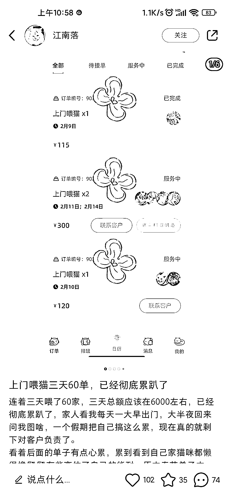

# 春节期间上门喂猫项目成爱猫人士快速赚钱

> 原文：[`www.yuque.com/for_lazy/xkrm14/bmzbn4i48vc0akg6`](https://www.yuque.com/for_lazy/xkrm14/bmzbn4i48vc0akg6)

作者： 泛音

日期：2024-02-14

点赞数：**45**

* * *

正文：

春节期间上门喂猫项目让不少爱猫人士挣到了一笔快钱，一位博主 3 天 60 单，净赚 6000 块。
简单来说上门喂猫一次的单价在 100 元上下，这位小红书博主把春节期间的日程表排的满满当当，累的直呼不想接单。
可是一单 100 块，一天干 10 单就是 1000 块，博主 3 天就是 6000 块，也就说勤快点一天能赚 2000 块，看在💰的面子上，上门喂猫真香！

* * *

评论区：

南风 : 这个订单是什么 app

泛音 : 这个不太清楚

逍遥公子 : 美团，宠物家，还有很多，去百度。最近忽然感觉，利用信息差赚钱无处不在。

泛音 : 公子厉害[鼓掌]

逍遥公子 : [调皮]💪还行😊

帅帅🔫🌱 : 时光序，记录待办清单的

亦仁 : 中标，术值+2。 在上方专栏点击 #中标，可查看所有中标风向标

泛音 : 谢谢老大

* * *

公众号懒人搜索，懒人专属群分享