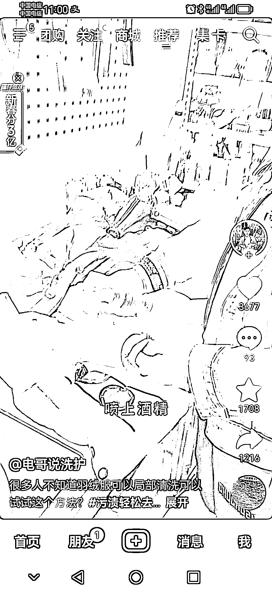
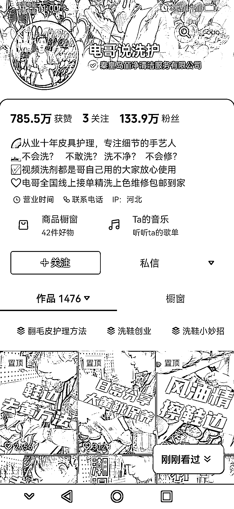
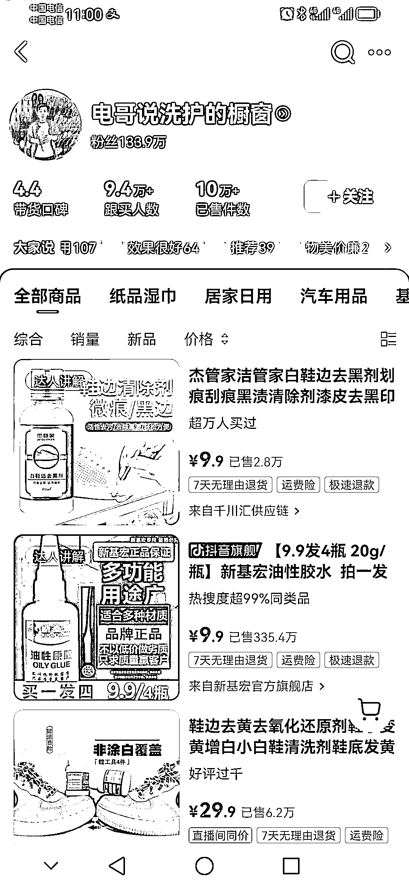

# 抖音视频卖货，洗护行业赚钱新趋势

> 原文：[`www.yuque.com/for_lazy/xkrm14/qyvavr8zrmye0rb8`](https://www.yuque.com/for_lazy/xkrm14/qyvavr8zrmye0rb8)

作者： 平凡

日期：2024-02-07

点赞数：**25**

* * *

正文：

懂洗护，从事洗护行业的完全可以在抖音拍视频卖货。尤其是干洗店，视频卖货赚的钱甚至要比开店赚的多。
如果懂洗护的，或是从事过的，完全可以搭建一个角落来拍视频或开直播。 这个博主拍视频带货，已经 10 万加了，洗护店主的人设加视频演示，完美解决信任问题。

* * *

评论区：

清风明月 : 一个品利润百万？胶水 9.9 四瓶那个😳

平凡 : 那个是商品的总销售量，不是他的带货量。关注按钮左边的才是他的带货量

清风明月 : 嗯，了解，那个店铺好赚……

* * *

公众号懒人搜索，懒人专属群分享