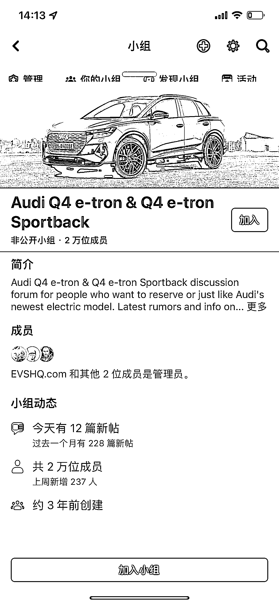
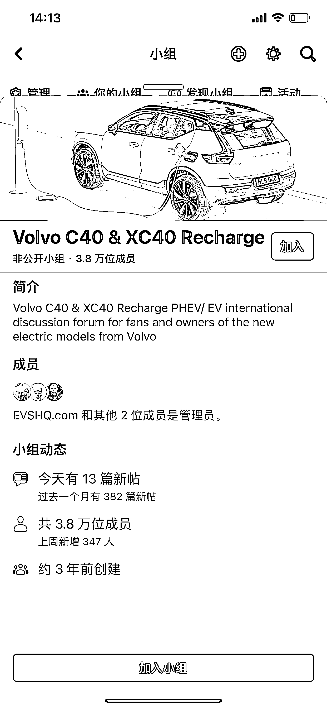
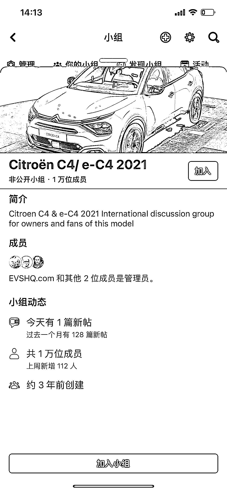
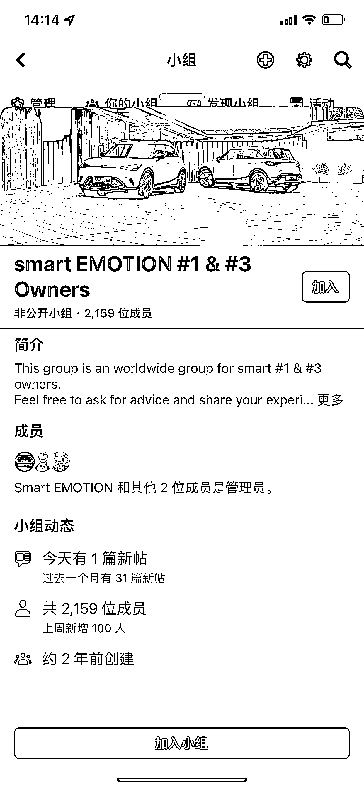
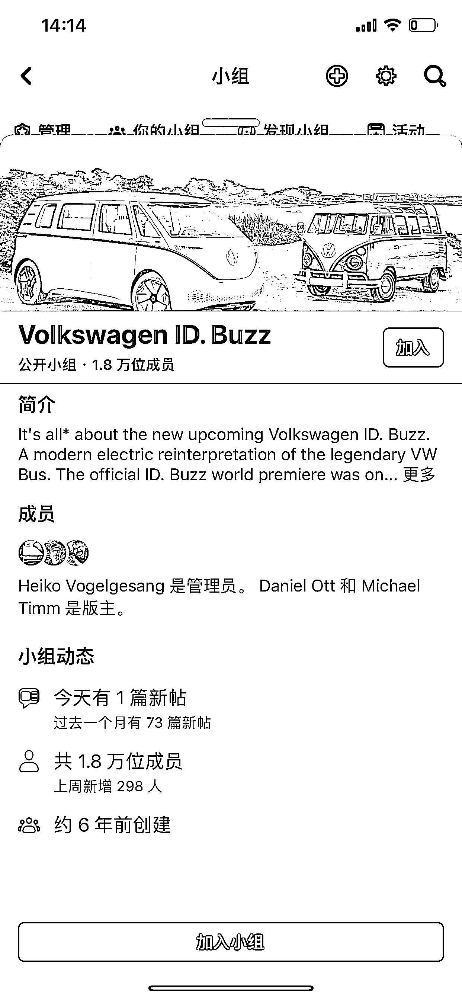
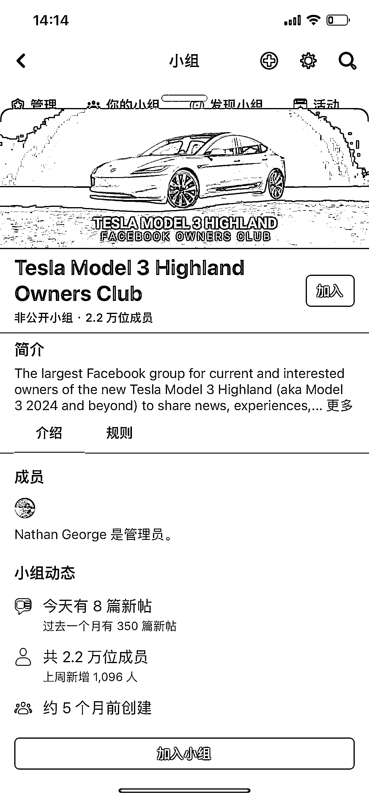
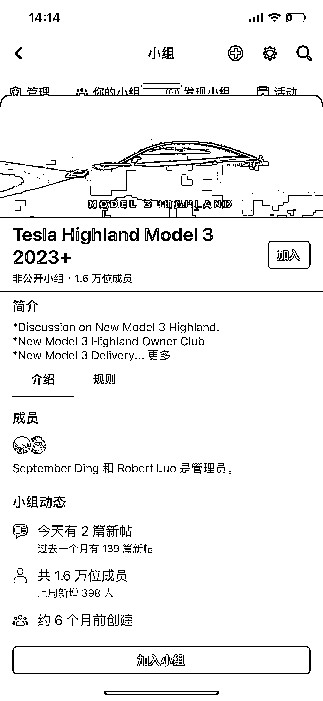
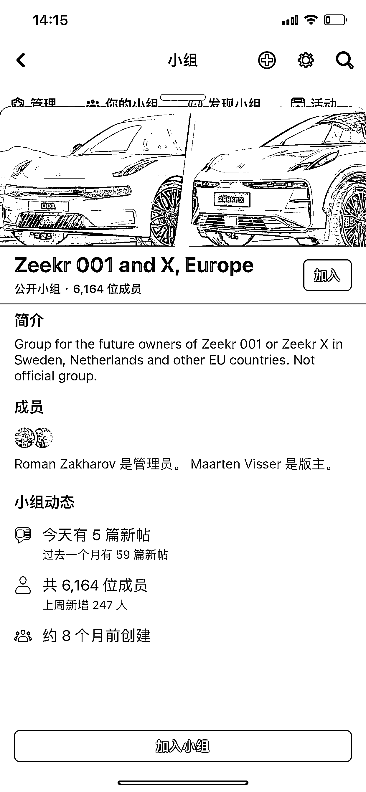

# Facebook 上的电动汽车车主小组成为汽车周边市场跨境电商的调研窗口

> 原文：[`www.yuque.com/for_lazy/xkrm14/ah43ffghycap6h6r`](https://www.yuque.com/for_lazy/xkrm14/ah43ffghycap6h6r)

作者： 林林 AIGC 写作

日期：2024-02-06

点赞数：**65**

* * *

正文：

Facebook 上面有一些电动汽车车主的小组，成员数量动辄好几万。 其中有不少小组，都是由一家叫做 evshq.com（ Electric Vehicles
Head-Quarter，电动车大本营）的网站带头发起的。另外，关于特斯拉 Model 3 新车的社群，不到半年就有 2.2 万人加入。
如果你想做汽车周边市场跨境电商，那么这些社群也能成为你调研终端市场用户需求的一道窗口。如果你本身就有汽车周边的生产线，也能通过这些小组实现流量变现。

* * *

评论区：

* * *

公众号懒人搜索，懒人专属群分享