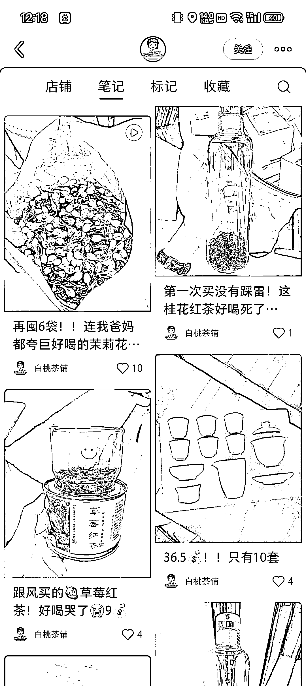
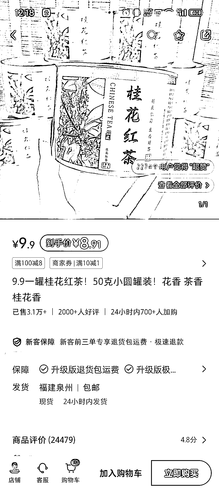
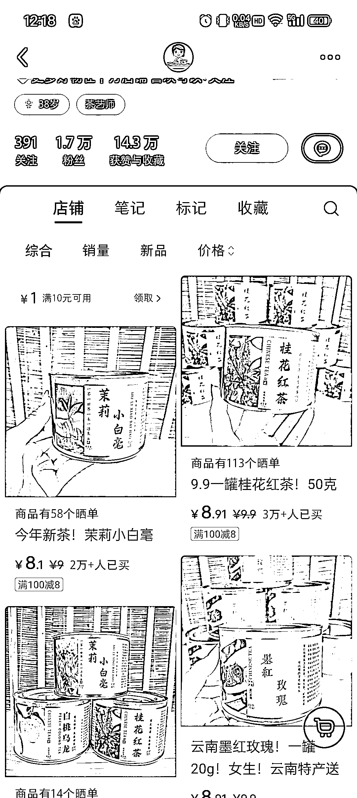

# 小红书养生赛道潜力巨大，小客单品表现出色

> 原文：[`www.yuque.com/for_lazy/xkrm14/hsxu12fsvqo3utkv`](https://www.yuque.com/for_lazy/xkrm14/hsxu12fsvqo3utkv)

作者： 雪梨啊

日期：2024-02-23

点赞数：**89**

* * *

正文：

小红书的养生赛道真的大有可为啊 小客单的品，笔记数据看着很一般，但是出单很厉害，好评+回购都不弱

* * *

评论区：

☀️☀️Aurora* : 请问这种货源哪里找

雪梨啊 : 不晓得啊，这个只能自己尝试找货源了，一手货源估计有价格优势，其他渠道可以试试包装上走区别

詹小乐滴娘亲 : 八块多有钱赚吗[撇嘴]

雪梨啊 : 就算利润只有 1 块钱，人家也快 4 万了[得意]

* * *

公众号懒人搜索，懒人专属群分享