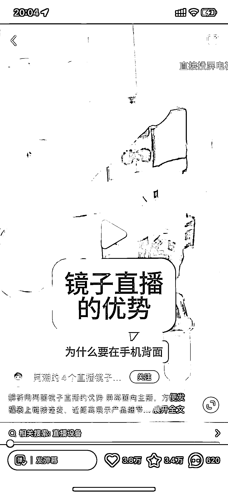
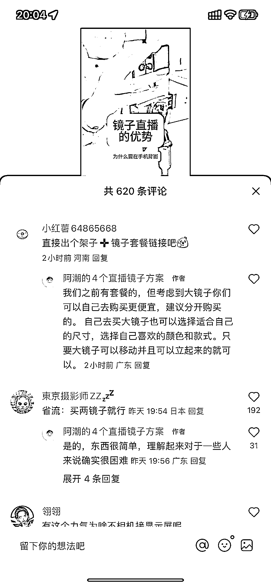
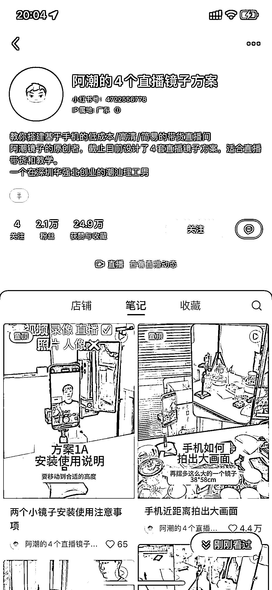

# 小红书教搭直播平台环境，利用镜子做后置摄像头直播

> 原文：[`www.yuque.com/for_lazy/xkrm14/zrig6pfmfkm5ovfy`](https://www.yuque.com/for_lazy/xkrm14/zrig6pfmfkm5ovfy)

作者： 隔云端

日期：2024-02-22

点赞数：**46**

* * *

正文：

小红书教搭直播平台环境 利用镜子做成后置摄像头直播， 优点：1、清晰度很高 2、可以近距离看手机，但人像显示不会那么大 变现：直播周边

* * *

评论区：

阿甜 AI 数字人（克隆* : 这个差点就买了 80➕ 就多了个镜子🪞，支架 9.9 呀！所以放弃了，这个做口播挺好的！看得到自己表情 不对 直接数字人也挺好

波叔 : 换了个形式，有意想不到效果

* * *

公众号懒人搜索，懒人专属群分享