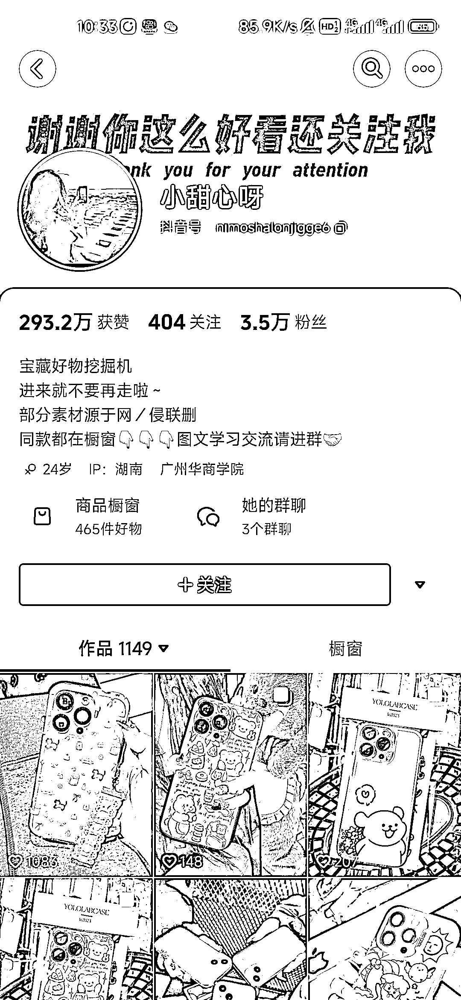
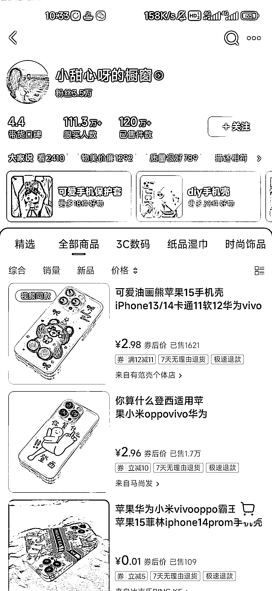
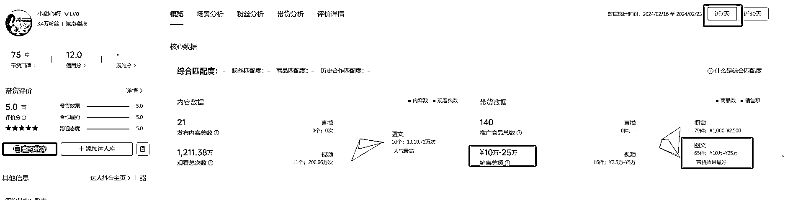
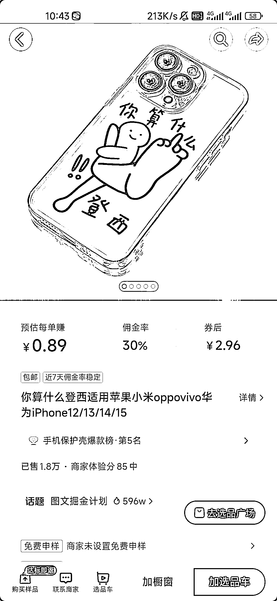

# 抖音小项目：图文带货手机壳，近七天销售额 10-25 万

> 原文：[`www.yuque.com/for_lazy/xkrm14/urwhe3gbm9vkbnn6`](https://www.yuque.com/for_lazy/xkrm14/urwhe3gbm9vkbnn6)

作者： 马小威

日期：2024-02-23

点赞数：**78**

* * *

正文：

抖音小项目 图文带货手机壳 近七天销售额 10-25 万 平均佣金 30% 累积出售 120W+件

* * *

评论区：

阿甜 AI 数字人（克隆* : 天！这数据！！

一炉 : 这事选品的能力吗？感觉视频很普通，甚至都是货源店视频

张叉叉 : 是收图文的学员吧，以一个看似简单操作但是数据超好的案例吸引人加入学图文。

西柚 : 发了 1000 多个视频，可见有段时间了

* * *

公众号懒人搜索，懒人专属群分享