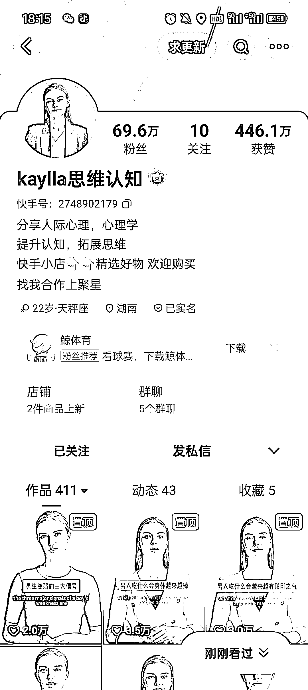
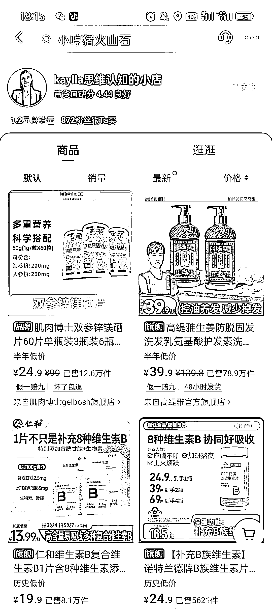
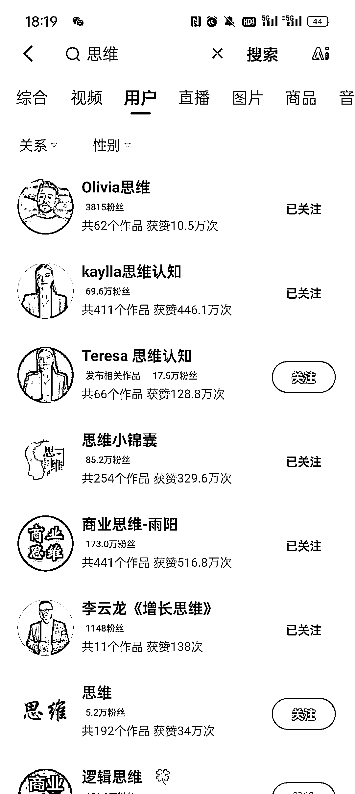

# 快手平台上的 AI 视频带货账号销量 1.2 万

> 原文：[`www.yuque.com/for_lazy/xkrm14/fec3mf849pm0ev9a`](https://www.yuque.com/for_lazy/xkrm14/fec3mf849pm0ev9a)

作者： 晓添

日期：2024-02-21

点赞数：**51**

* * *

正文：

快手平台，不到 5 个月的号（图一）， ai 类视频，主要是视频挂链接卖保健类维生素，销量 1.2 万（图二）
看到三个类似的账号（图三），其他赛道的品都可以尝试用 ai 作品带货

* * *

评论区：

晓添 : 谢谢亦仁大大[呲牙]

富贵儿 : 最近抖音，视频号和小红书都在打击 ai 人。快手没试过，不知道现在政策怎么样。

阿甜 AI 数字人（克隆* : 我做这个的 封得厉害

* * *

公众号懒人搜索，懒人专属群分享