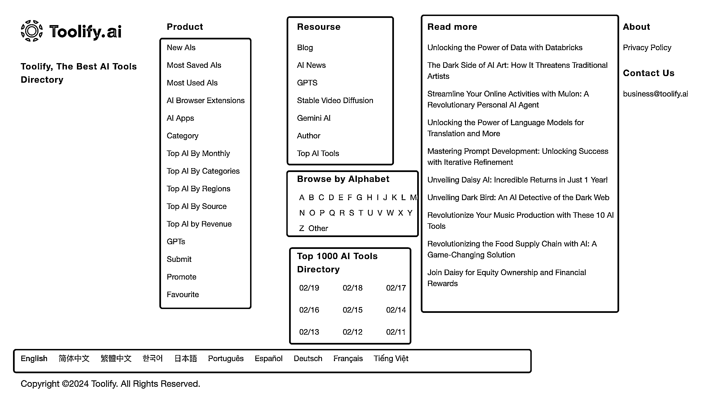

# AI 导航网站 Toolify 的优化策略：首页底部红色框的细节值得学习

> 原文：[`www.yuque.com/for_lazy/xkrm14/kagkgy97ggkq9ea7`](https://www.yuque.com/for_lazy/xkrm14/kagkgy97ggkq9ea7)

作者： 哥飞

日期：2024-02-19

点赞数：**44**

* * *

正文：

跟着上个月访问量从 154 万增长到 274 万的 AI 导航网站 学 SEO。
有很多很多细节值得学习，即使是首页底部的这一块内容，每一个红色框都有它的用途，不是随便乱放的。
这么做的目的是把有多层级的内页横向打平，从深度搜索变成广度搜索，让搜索引擎爬虫在首页就能够快速进入各个内页列表抓取页面。[Best AI Tools
Directory & AI Tools List - Tool...](https://Toolify.ai)

* * *

评论区：

* * *

公众号懒人搜索，懒人专属群分享