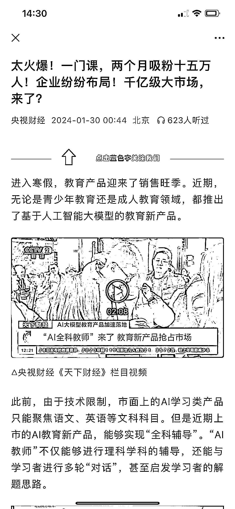
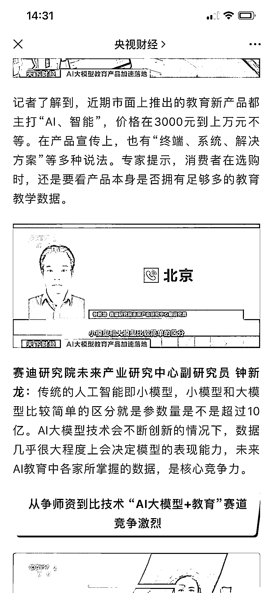

# AI+教育迎来千亿级大市场

> 原文：[`www.yuque.com/for_lazy/xkrm14/lyvrru6p1ggiktpo`](https://www.yuque.com/for_lazy/xkrm14/lyvrru6p1ggiktpo)

作者： 菲菲

日期：2024-02-18

点赞数：**33**

* * *

正文：

千亿级大市场来了！ 2023 年 AI 的热度全年都在，随着奥特曼发布了视频大模型，AI 的热度又掀起了一轮高潮。
AI 时代如何利用 AI 开创新的行业，或者利用 AI 降本增效，将成为未来这几年的重中之重。
央视财经报道，AI+教育迎来千亿级大市场。近期，无论是青少年教育还是成人教育领域，都推出了基于人工智能大模型的教育新产品。北京一家成人教育企业由 AI 数字人讲解的课程，上线两个月，就吸引了超过十五万名学员。
近期上市的 AI 教育新产品，能够实现“全科辅导”。“AI 教师”不仅能够进行理科学科的辅导，还能与学习者进行多轮“对话”，甚至启发学习者的解题思路。
身处 AI 这个行业，或者有这方面资源的圈友可以提前布局，在这个大盘子里分一杯羹。

* * *

评论区：

* * *

公众号懒人搜索，懒人专属群分享