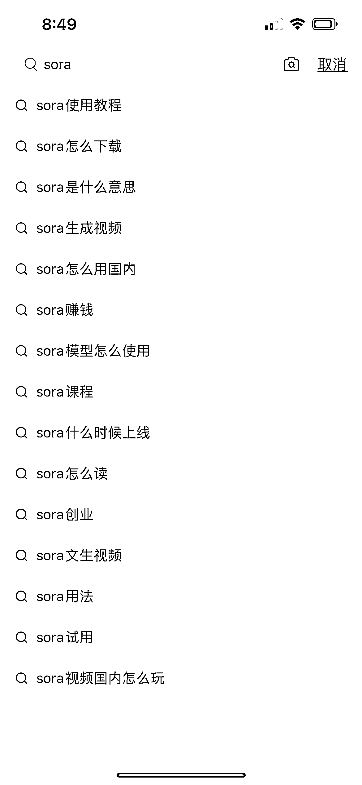
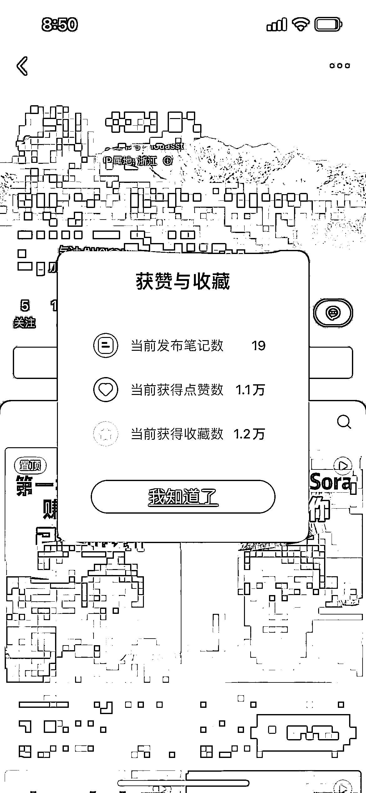
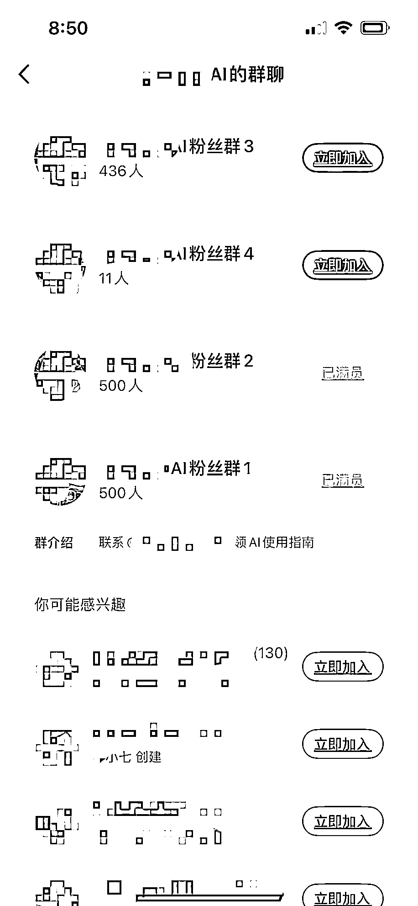
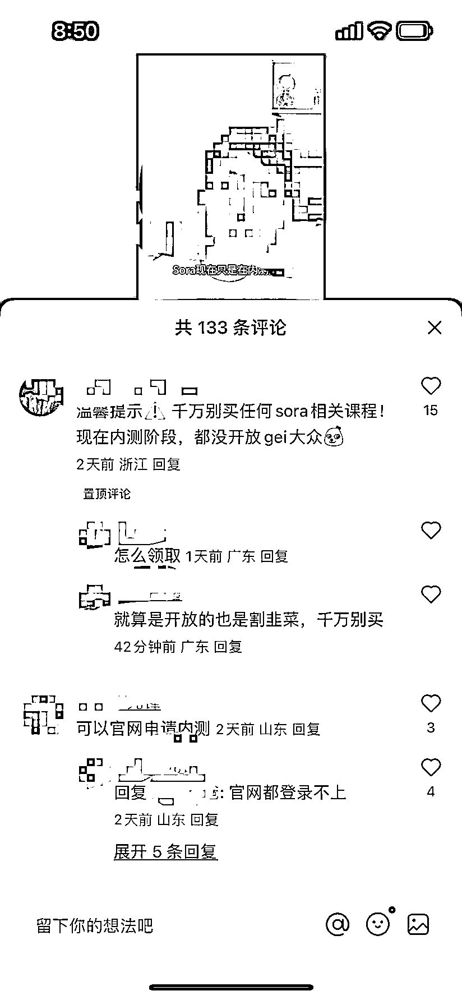

# sora 出现将催生割韭菜和反割韭菜的知识博主，小红书博主笔记 19 篇

> 原文：[`www.yuque.com/for_lazy/xkrm14/snukh4hi1ivzmubs`](https://www.yuque.com/for_lazy/xkrm14/snukh4hi1ivzmubs)

作者： 常玉静

日期：2024-02-23

点赞数：**49**

* * *

正文：

sora 出现将会又催生一批割韭菜和反割韭菜的知识博主，比如这位小红书博主笔记 19 篇，群满了 3 个了，用 AI 使用指南做钩子吸引用户到私域，做相关行业的可以看看~

* * *

评论区：

zz : 这码的太多了 啥也看不见

常玉静 : 第二次中标，感谢亦仁大大～

阿甜 AI 数字人（克隆* : sora 会把之前的 gpt 再复制一遍 然后增加视频剪辑方面！之前 gpt 是文案相关，got 做小红书 做选题 什么的 这次直接是文案➕视频 buff 加持了

波叔 : 现在的 sora 基本都是割韭菜

* * *

公众号懒人搜索，懒人专属群分享