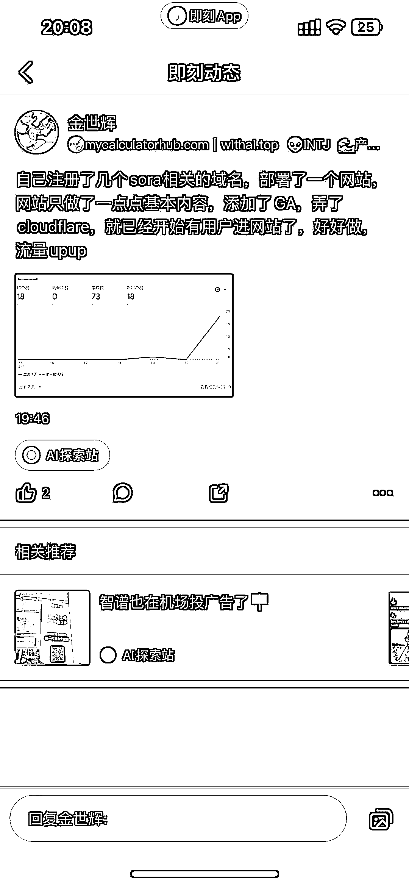

# 利用 Sora 势头，买域名上线网站，轻松获取流量

> 原文：[`www.yuque.com/for_lazy/xkrm14/nxf2nkzlgqdzt0zk`](https://www.yuque.com/for_lazy/xkrm14/nxf2nkzlgqdzt0zk)

作者： 蛤蟆先生

日期：2024-02-22

点赞数：**43**

* * *

正文：

趁着 Sora 这波势头，买几个域名，上线几个网站，不愁没有流量，参考哥飞大佬的 SoraWebUi

* * *

评论区：

focus : GA 是谷歌广告？

蛤蟆先生 : 对，Google Adsense

蛤蟆先生 : 看了下，应该是 Google Analytics 哈

波叔 : 挖好鱼塘，等鱼进窝

* * *

公众号懒人搜索，懒人专属群分享